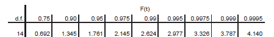

```{r setup, include=FALSE}
knitr::opts_chunk$set(echo = TRUE, warning = F, message = F, error = F)
```

```{r, echo = F}
library(ggplot2)
library(dplyr)
library(cowplot)
library(extrafont)
library(patchwork)

theme_set(theme_bw() + theme(plot.background = element_rect(fill = "#ffffe6", color = "#ffffe6"),
                             legend.box.background = element_rect(color = "black")))
```

##

<div style="position:absolute;width:80%;height:400px;border: 10px double;padding: 150px 10px; left:10%; top:100px;">
<p style="text-align:center;font-size: 2em;">
t-test för ett stickprov
</p>

<p style="text-align:center;">
Motsvarar *Biometri*, kap 6
</p>
</div>

# I korthet

Slumpmässig variation är en grundläggande utmaning för all kunskapsinhämtning

<div class="fragment fade-in">
I en statistisk undersökning vill vi använda **punktskattningar** från ett **stickprov** för att uttala oss om egenskaper i en **population**
</div>

<div class="fragment fade-in">
Skattningar är beroende av slumpen och vi behöver därför metoder som hanterar slumpmässig variation
</div>

<div class="fragment fade-in">
**Konfidensintervall** gör det möjligt att ringa in populationens egenskaper med en förbestämd säkerhet
</div>

<div class="fragment fade-in">
**Hypotestest** gör det möjligt att dra *statistiskt säkerställda* slutsatser om populationens egenskaper
</div>

<div class="fragment fade-in">
För kontinuerlig data används ofta ett **t-test**
</div>

<div class="fragment fade-in">
**t-test för ett stickprov** testar om medelvärdet i en variabel är skilt från ett hypotesvärde
</div>

## Population och stickprov

<div style="width:50%;float:right;left:1200px;top:100px;position:absolute;">
```{r, echo = F, fig.height=6, fig.width = 4}
dat <- data.frame(t = seq(0, 2*pi, length.out = 1000)) %>% 
  mutate(x = cos(t), y = sin(t))
dat_arrow <- data.frame(c = rep(1:3, each = 2),
                        x1 = c(-1 + 0.1, 0, 1 - 0.1),
                        x2 = c(-2/3 + 0.1, 0, 2/3 - 0.1),
                        y1 = c(0,-1 + 0.1, 0),
                        y2 = c(-2,2/3 - 2 - 0.1, -2))

ggplot(dat) +
  geom_polygon(aes(x, y), fill = "#fcc2ff", col = "black") +
  geom_polygon(aes(x / 1.5, y / 1.5 - 2), fill = "#bffcc6", col = "black") +
  geom_segment(aes(x1, y1, xend = x2, yend = y2), data = dat_arrow, 
               arrow = arrow(length = unit(0.30,"cm"), type = "closed")) +
  annotate("text", 0, 0, label = expression("Population ("*mu*", "*sigma*")"), 
           size = 8, family = "Garamond") +
  annotate("text", 0, -2, label = expression("Stickprov ("*bar(x)*", "*s*")"), 
           size = 8, family = "Garamond") +
  theme_nothing() +
  theme(panel.background = element_rect(fill = "#ffffe6", color = NA),
        plot.background = element_rect(fill = "#ffffe6", color = NA)) +
  ylim(-3,1)
```
</div>


<div style="width:50%;">
I en statistisk undersökning vill vi veta något om en egenskap (en *variabel*) i en *population*

<div class="fragment fade-in">
Ofta omöjligt att observera hela populationen, <span class="fragment fade-in"> så vi drar ett stickprov om $n$ observationer </span>
</div>

<div class="fragment fade-in">
Stickprovet kan användas till att *punktskatta* egenskaper som medelvärde och varians i populationen
</div>

<div class="fragment fade-in">
Egenskaper i populationen betecknas med grekiska bokstäver ($\mu$ och $\sigma$) och skattningarna betecknas med romerska bokstäver ($\bar x$ och $s$)
</div>

<div class="fragment fade-in">
Valet av punktskattning beror på variabeln vi undersöker
</div>

<div class="fragment fade-in">
Om populationsvariabeln är normalfördelad är vi intresserade av skattade värden för medelvärde och varians (stickprovsmedelvärde och stickprovsvarians)
</div>
</div>

# Punktskattningar är utfall av slumpvariabler

Eftersom observationerna i stickprovet är slumpmässiga kommer även punktskattningarna bero på slumpen

<div class="fragment fade-in">
Vi kan använda punktskattningar för att ringa in populationsmedelvärdet $\mu$ med ett *konfidensintervall*
</div>

<div class="fragment fade-in">
Ett konfidensintervall täcker $\mu$ med en bestämd konfidens, ofta 95 procent.
</div>

<div class="fragment fade-in">
```{r, echo = F, fig.height = 3, warning = F, fig.align = 'center'}
set.seed(97)
a <- scale(rnorm(15))
b <- 36 + 12 * a

dat <- data.frame(b)
g1 <- ggplot(dat, aes(b, -0.1)) +
  geom_point() +
  annotate("point", 36, -0.2, col = "blue") +
  annotate("text", 36, -0.2, label = expression(bar(x)), vjust = 1.5) +
  geom_line(aes(x = c(29.3562, 42.645), y = -0.15), inherit.aes = F, data = data.frame()) +
  geom_line(aes(x = 29.3562, y = c(-0.13, -0.15)), inherit.aes = F, data = data.frame()) +
  geom_line(aes(x = 42.645, y = c(-0.13, -0.15)), inherit.aes = F, data = data.frame()) +
  xlab("x") +
  theme(axis.title.y = element_blank(), axis.text.y = element_blank(), axis.ticks.y = element_blank(),
        panel.grid = element_blank()) +
  coord_cartesian(ylim = c(-0.3,0.2), xlim = c(0,80)) +
  scale_x_continuous(breaks = c(seq(0, 100, 20), 30, 36))
g1
```
</div>

<div class="fragment fade-in">
Punktskattningen av medelvärdet är $\bar x = 36$
</div>

<div class="fragment fade-in">
Det sanna populationsmedelvärdet ligger med 95 procents konfidens i det angivna intervallet
</div>

## Konfidensintervall med känd standardavvikelse

Om man har en normalfördelad populationsvariabel och känd populationsstandardavvikelse $\sigma$ baseras konfidensintervallet på normalfördelningen

```{r, echo = F, fig.align='center', fig.width=16, fig.height=2.8}
dat <- expand.grid(p = c(0.95, 0.975, 0.995, 0.9995), x = seq(-4,4,0.01))
dat <- dat %>% 
  arrange(p, x) %>% 
  mutate(q = qnorm(p),
         y = dnorm(x))
dat_q <- dat

for(j in c(0.95, 0.975, 0.995, 0.9995)){
  dat <- dat_q %>% filter(p == j)
  g_temp <- ggplot(dat, aes(x, y)) +
    geom_line() +
    geom_hline(yintercept = 0) +
    geom_ribbon(aes(ymin = 0, ymax = y), data = dat %>% filter(x > q), fill = "brown1") +
    geom_ribbon(aes(ymin = 0, ymax = y), data = dat %>% filter(x < -q), fill = "brown1") +
    theme(panel.grid = element_blank(), axis.text.y = element_blank(), axis.ticks.y = element_blank(), axis.title.y = element_blank()) +
    scale_x_continuous(breaks = round(c(-unique(dat$q), 0, unique(dat$q)), 3),
                       labels = round(c(-unique(dat$q), 0, unique(dat$q)), 3)) +
    ggtitle(paste0(round(100 * 2*(1 - j), 1), " procent i svansarna")) +
    xlab("")
  assign(paste0("g", j), g_temp)
}

g0.95 | g0.975 | g0.995 | g0.9995
```

<div class="fragment fade-in">
För en given svanssannolikhet $\alpha$ använder vi beteckningen $z_{1 - \alpha/2}$ för värdet på x-axeln, t.ex $z_{(1 - 0.05/2)} = z_{0.975} = 1.96$ eftersom sannolikheten i svansarna bortom $1.96$ är $0.05$
</div>

<div class="fragment fade-in">
Vi kan föra över det standardiserade intervallet till ett skattat medelvärde genom formeln

$$\bar x \pm z_{(1- \alpha/2)}\frac{\sigma}{\sqrt n}$$
</div>

<div class="fragment fade-in">
där $\bar x$ är det skattade medelvärdet, $z_{(1 - \alpha/2)}$ är värdet från den standardiserade normalfördelningen, $\sigma$ är den kända standardavvikelsen, och $n$ är stickprovets storlek
</div>

## 

**Konfidensintervall, känd standardavvikelsen, exempel**

```{r, echo = F, fig.height = 2, warning = F, fig.align = 'center'}
g1
```

I datan ovan är det skattade medelvärdet $\bar x = 36$, den givna standardavvikelsen $\sigma = 12$, och stickprovsstorleken $n = 15$

<div class="fragment fade-in">
Ett 95-procentigt konfidensintervall ges av

$$\bar x \pm z_{(1 - 0.05/2)}\frac{\sigma}{\sqrt n} = 36 \pm 1.96 \frac{12}{\sqrt 15} = 36 \pm 6.07$$
</div>

<div class="fragment fade-in">
Intervallet också kan uttryckas $(29.93, 42.07)$
</div>

<div class="fragment fade-in">
Ett 99-procentigt konfidensintervall ges av

$$\bar x \pm z_{(1 - 0.01/2)}\frac{\sigma}{\sqrt n} = 36 \pm 2.576 \frac{12}{\sqrt 15} = 36 \pm 7.98$$

eller $(28.02, 43.98)$
</div>

## Konfidensintervall med skattad standardavvikelse

Om standardavvikelsen är okänd kan vi skatta den från stickprovet

<div class="fragment fade-in" data-fragment-index = "1">
Eftersom skattningen är mindre säker är det intutivt att vi behöver ett bredare konfidensintervall
</div>

<div class="fragment fade-in" data-fragment-index = "4" style="float:right; width:50%;">
```{r, echo = F, fig.height=4, fig.align='center'}
dat_t <- expand.grid(x = seq(-6,6,0.01),
                df = c(1,2,5,10, Inf)) %>% 
  mutate(y = dt(x, df),
         df = as.ordered(df))
ggplot(dat_t, aes(x, y, col = df, group = df)) +
  geom_line(size = 2, alpha = 0.75) +
  coord_cartesian(xlim = c(-4,4))
```

```{r, echo = F, fig.height=2, fig.align='center'}
ggplot(dat_t, aes(x, y, col = df, group = df)) +
  geom_line(size = 2) +
  facet_wrap(~ df, ncol = 5) +
  theme(legend.position = "none") +
  coord_cartesian(xlim = c(-4,4))
```
</div>

<div class="fragment fade-in" data-fragment-index = "2">
<br>

Den teoretiska konsekvensen är att vi använder en *t-fördelning* istället för en normalfördelning
</div>

<div class="fragment fade-in" data-fragment-index = "3">
t-fördelningen är en kontinuerlig fördelning med en ingående parameter - *antalet frihetsgrader* (eng. degrees of freedom, df)
</div>

<div class="fragment fade-in">
t-fördelningen uppstår när man standardiserar ett medelvärde med en skattad standardavvikelse:

$$\frac{\bar X - \mu}{s/\sqrt n} \sim t(n - 1)$$
</div>

## Frihetsgrader

*Frihetsgrader* är ett statistiskt begrepp för en datamängds storlek efter påförd begränsning

<div class="fragment fade-in">
När vi skattar $s$ använder vi serien $x_i - \bar x$

$$s^2 =\frac{1}{n - 1} \sum_{i=1}^n (x_i - \bar x)^2$$
</div>

<div class="fragment fade-in">
Den serien har egenskapen att den alltid summerar till noll (en begränsning)
</div>

<div class="fragment fade-in">
Vid skattningen av $s$ använder vi alltså en serie som innehåller *mindre* information än våra $n$ observationer
</div>

<div class="fragment fade-in">
Antalet frihetsgrader ges av antalet observationer minus antalet begränsningar, så vid skattningen av $s$ har vi $n - 1$ frihetsgrader
</div>

<div class="fragment fade-in">
Om vi standardiserar med en skattad standardavvikelse får vi en t-fördelning med $n - 1$ frihetsgrader

$$\frac{\bar X - \mu}{s / \sqrt n} \sim t(n-1)$$
</div>

## Biometri, tabell 5

Vid en skattad standardavvikelse baseras konfidensintervallet på en t-fördelning med $n - 1$ frihetsgrader

```{r, echo = F, fig.align='center', fig.width=16, fig.height=3}
dat <- expand.grid(p = c(0.95, 0.975, 0.995, 0.9995), x = seq(-5,5,0.01))
dat <- dat %>% 
  arrange(p, x) %>% 
  mutate(q = qt(p, 14),
         y = dt(x, 14))
dat_q <- dat

for(j in c(0.95, 0.975, 0.995, 0.9995)){
  dat <- dat_q %>% filter(p == j)
  g_temp <- ggplot(dat, aes(x, y)) +
    geom_line() +
    geom_hline(yintercept = 0) +
    geom_ribbon(aes(ymin = 0, ymax = y), data = dat %>% filter(x > q), fill = "brown1") +
    geom_ribbon(aes(ymin = 0, ymax = y), data = dat %>% filter(x < -q), fill = "brown1") +
    theme(panel.grid = element_blank(), axis.text.y = element_blank(), axis.ticks.y = element_blank(), axis.title.y = element_blank()) +
    scale_x_continuous(breaks = round(c(-unique(dat$q), 0, unique(dat$q)), 3),
                       labels = round(c(-unique(dat$q), 0, unique(dat$q)), 3)) +
    ggtitle(paste0(round(100 * 2*(1 - j), 1), " procent i svansarna")) +
    xlab("")
  assign(paste0("g", j), g_temp)
}

g0.95 | g0.975 | g0.995 | g0.9995
```

<div class="fragment fade-in">
Tabellvärden för x-axeln betecknas $t_{(1-\alpha / 2, df)}$ och kan hämtas från en tabell över t-fördelningen, t.ex tabell 5 i *Biometri*
</div>

<div class="fragment fade-in">

</div>

<div class="fragment fade-in">
För ett tabellvärde motsvarande fem procent i svansarna och $n = 15$ tittar vi på $t_{(1-0.05 / 2, 15 - 1)} = t_{(0.975, 14)} = 2.145$
</div>

<div class="fragment fade-in">
Den sista raden i tabell 5 ger värden för en t-fördelning med oändligt antal frihetsgrader, dvs en standardiserad normalfördelning
</div>

##

**Konfidensintervall, skattad standardavvikelsen, exempel**

```{r, echo = F, fig.height = 2, warning = F, fig.align = 'center'}
g1
```

Som tidigare är det skattade medelvärdet $\bar x = 36$ och stickprovsstorleken $n = 15$, men standardavvikelsen är nu skattad $s = 12$

<div class="fragment fade-in">
Ett 95-procentigt konfidensintervall ges av

$$\bar x \pm t_{(1- 0.05/2, 14)}\frac{\sigma}{\sqrt n} = 36 \pm 2.145 \frac{12}{\sqrt 15} = 36 \pm 6.65$$

vilket vi kan beräkna till $(29.35, 42.65)$
</div>

<div class="fragment fade-in">
På grund av den skattade standardavvikelsen hämtar vi tabellvärdet från en t-fördelning och får ett bredare konfidensintervall
</div>

<div class="fragment fade-in">
Termen $\frac{s}{\sqrt n}$ kallas *medelfelet* (eng. standard error, SE)
</div>

## Tolkning av konfidensintervall

Konfidensintervallet brukar presenteras som att det täcker populationsmedelvärdet $\mu$ med en given konfidens (ofta 95 procent)

<div class="fragment fade-in">
En ny undersökning kan ge andra skattningar av $\bar x$ och $s$, och således ett annat konfidensintervall
</div>

<div class="fragment fade-in">
Om vi upprepar försöket ett stort antal gånger kommer ett 95-procentigt konfidensintervall täcka populationsmedelvärdet 95 procent av gångerna
</div>

<br>

<div class="fragment fade-in">
Märk särskilt att konfidensintervallet är ett intervall för medelvärdesskattningen
</div>

<div class="fragment fade-in">
Intervallet ska **inte** tolkas som att 95 procent av observationerna ligger i intervallet
</div>

# Slutsatser från data

Konfidensintervallet kan användas till att dra slutsatser från sin data

<div class="fragment fade-in">
Värden som inte ligger i intervallet är mindre troliga att vara det sanna populationsmedelvärdet
</div>

<div class="fragment fade-in">
En relaterad metod för att dra slutsatser är *hypotestestet*
</div>

<div class="fragment fade-in">
Vid ett hypotestest jämförs en specifik hypotes med observerad data
</div>

<div class="fragment fade-in">
Ett resultat är *signifikant* om observationerna är osannolika givet hypotesen
</div>

<div class="fragment fade-in">
**Hypotestestens steg**

Formell gång för att ställa observation mot hypotes

>1. Hypoteser
>2. Testfunktion
>3. Testfördelning
>4. p-värde (beräkning eller uppskattning)
>5. Slutsats

<div class="fragment fade-in">
HTTPS
</div>
</div>

## Val av hypotestest

Typen av variabel påverkar det slumpmässiga beteendet

<div class="fragment fade-in">
och man får därför skilda hypotestest för skilda variabeltyper
</div>

<div class="fragment fade-in">
Under kursen tittar vi på

- t-test. Kontinuerlig variabel. En eller två grupper
- Binomialtest och z-test. För binär data (två möjliga utfall)
- $\chi^2$-test. För  nominella variabler
- F-test. Kontinuerlig variabel. Två eller fler grupper
</div>

# t-test

t-testen är test för **kontinuerliga** variabler som följer en **normalfördelning**

<div class="fragment fade-in">
<div style="float:right;width:50%;font-size:0.75em;">
```{r, echo = F, fig.align='left', fig.height=2}
tibble(x1 = rnorm(10, 50, 4), x = x1 - mean(x1) + 50) %>% 
  ggplot(aes(x, y = 0)) +
  geom_point() +
  geom_vline(xintercept = 50, col = "red") +
  xlab("Höjd (mm)") +
  theme(axis.text.y = element_blank(), axis.ticks.y = element_blank(), axis.title.y = element_blank())
```

Är populationsmedelvärdet skilt från 50?
</div>

**t-test för ett stickprov**

Testar om populationsmedelvärdet är skilt från en specifik nollhypotes

<br><br><br>
</div>

<div class="fragment fade-in">
<div style="float:right;width:50%;font-size:0.75em;">
```{r, echo = F, fig.align='left', fig.height=2}
tibble(x = rnorm(20, rep(c(0, 5), each = 10) + 50, 4), Grupp = rep(c("Gulsippa", "Vitsippa"), each = 10)) %>% 
  ggplot(aes(x, y = Grupp, col = Grupp)) +
  geom_point() +
  theme(legend.position = "none") +
  xlab("Höjd (mm)") + ylab("Art")
```

Är populationsmedelvärdena skilda från varandra?
</div>

**t-test för två stickprov**

Testar om det finns någon skillnad i populationsmedelvärde mellan två populationer
</div>

## t-test för ett stickprov

Ett stickprov om $n$ observationer

Skattar medelvärdet $\bar x$ och standardavvikelsen $s$

Vill ställa det mot en nollhypotes $H_0$

<div class="fragment fade-in">
<div style="width:55%">
**Numeriskt exempel**

Man har identifierat en genotyp av pärlhyacint och vill veta om dess höjd vid blomning är skild från 30 cm

Man sätter femton exemplar och får $\bar x = 36$ och $s = 12$ $(s^2 = 144)$
</div>

<div class= "fragment fade-in" style="position:absolute;left:60%;width:40%;top:200px">

</div>
</div>

## Illustration

```{r, echo = F, fig.height = 3, warning = F, fig.align = 'center'}
set.seed(97)
a <- scale(rnorm(15))
b <- 36 + 12 * a

dat <- data.frame(b)
g1 <- ggplot(dat, aes(b, -0.1)) +
  geom_point() +
  annotate("point", 30, -0.2, col = "red") +
  annotate("point", 36, -0.2, col = "blue") +
  annotate("text", 30, -0.2, label = expression(mu[0]), vjust = 1.5) +
  annotate("text", 36, -0.2, label = expression(bar(x)), vjust = 1.5) +
  xlab("x") +
  theme(axis.title.y = element_blank(), axis.text.y = element_blank(), axis.ticks.y = element_blank(),
        panel.grid = element_blank()) +
  coord_cartesian(ylim = c(-0.3,0.5), xlim = c(0,80)) +
  scale_x_continuous(breaks = c(seq(0, 100, 20), 30, 36))
g1
```

<div class="fragment fade-in">
Vår data kommer från en fördelning med något okänt populationsmedelvärde $\mu$
</div>

<div class="fragment fade-in">
Vi har en *nollhypotes* att $\mu$ är lika med 30, $\mu_0 = 30$
</div>

<div class="fragment fade-in">
*Vad är sannolikheten för det här utfallet om medelvärdet faktiskt är 30?*
</div>

<div class="fragment fade-in">
Om den sannolikheten är låg, tyder det på att det sanna populationsmedelvärdet är skilt från 30
</div>

##

**Hypoteser**

Nollhypotes och alternativhypotes

$H_0: \mu = 30$

$H_1: \mu \neq 30$

<div class="fragment fade-in">
**Testfunktion**

t-testets testfunktion ges av att standardisera mot nollhypotesens värde

$t = \frac{\bar x - \mu_0}{\sqrt{s^2/n}}$
</div>

<div class="fragment fade-in">
Sätter in värden i testfunktionen

$t = \frac{36 - 30}{\sqrt{144/15}} = 1.936$
</div>

<div class="fragment fade-in">
**Testfördelning**

Om nollhypotesen stämmer ska $t$ komma från en $t$-fördelning med $n-1$ frihetsgrader
</div>

## 

**p-värde**

p-värdet beräknas som ytan bortom $t$ i en t-fördelning med $n-1=14$ frihetsgrader

<div style="float: right;">
```{r, echo = F, fig.height=3.5, fig.width = 6}
x_bar <- 36
s <- 12
n <- 15
mu_0 <- 30

t_obs_pos <- abs(round((x_bar - mu_0) / (s / sqrt(n)), 2))
t_obs <- round((x_bar - mu_0) / (s / sqrt(n)), 2)
t_obs_2 <- (x_bar - mu_0) / (s / sqrt(n))

dat <- tibble(t = seq(-5,5,0.01), y = dt(t, n - 1))
g_obs <- ggplot(dat, aes(t, y)) + 
  geom_ribbon(aes(ymax = y, ymin = 0), data = dat %>% filter(t >= t_obs_pos), fill = "brown1") +
  geom_ribbon(aes(ymax = y, ymin = 0), data = dat %>% filter(t <= -t_obs_pos), fill = "brown1") +
  geom_line() +
  geom_hline(yintercept = 0) +
  ylab("f(t)") +
  labs(title = "t-fördelning, 14 fg") +
  theme(panel.grid = element_blank())
g_obs
```
</div>

Eftersom alternativhypotesen är tvåsidig medtas bägge svansarna

<div class="fragment fade-in">
Man kan beräkna p-värdet i valfritt datorprogram och få $p = `r round(2*pt(-abs(t_obs_2), 14), 4)`$
</div>

<div class="fragment fade-in">
Eller titta i tabell 5, rad 14. Eftersom $t$ ligger mellan $1.761$ och $2.145$ måste det motsvara ett tvåsidigt p-värde mellan $10$ och $5$ procent
</div>

## Biometri, tabell 5

<div class="fragment fade-in" data-fragment-index="2" style="float:right; width: 40%;font-size:1em; text-align:center;border: 5px solid; padding:15px; border-radius:10px;background-color:#cceeee">


Vid 14 frihetsgrader är ytan under kurvan till vänster om 2.145 lika med 0.975

eller 

$$t_{(0.975, 14)} = 2.145$$
</div>

<div class="fragment fade-in" data-fragment-index="1">
Tabell 5 i *Biometri* anger t-fördelningens fördelningsfunktion

En sannolikhet anges i översta raden och ett antal frihetsgrader anges i vänstra kolumnen

Tabellens inre värde ger ett t-värde sådant att sannolikheten (*ytan under kurvan*) till vänster om det värdet ges av sannolikheten
</div>

<div class="fragment fade-in">
```{r, echo = F, fig.height=3, fig.width=10}
dat <- tibble(t = seq(-5,5,0.01), y = dt(t, n - 1))
g_tab <- ggplot(dat, aes(t, y)) + 
  geom_ribbon(aes(ymax = y, ymin = 0), data = dat %>% filter(t >= 2.145), fill = "olivedrab1") +
  geom_ribbon(aes(ymax = y, ymin = 0), data = dat %>% filter(t <= -2.145), fill = "olivedrab1") +
  geom_line() +
  geom_hline(yintercept = 0) +
  ylab("f(t)") +
  labs(title = "t-fördelning, 14 fg") +
  theme(panel.grid = element_blank(), axis.text.x = element_text(size = 15)) +
  scale_x_continuous(breaks = c(-2.145, 0, 2.145), labels = c("-2.145", "0", "2.145"))

g_obs_s <- g_obs + 
  scale_x_continuous(breaks = c(-1.936, 0, 1.936), labels = c("-1.936", "0", "1.936")) +
  theme(panel.grid = element_blank(), axis.text.x = element_text(size = 15))

g_obs_s + g_tab
```
</div>

<div class="fragment fade-in">
Den gröna arean motsvarar fem procent (2.5 procent i vardera svans)

Eftersom vårt observerade t-värde 1.936 ligger närmre nollan måste *svanssannolikheten* (den röda arean) vara minst fem procent
</div>

## 

**p-värde**

p-värdet beräknas som ytan bortom $t$ i en t-fördelning med $n-1=14$ frihetsgrader

<div style="float: right;">
```{r, echo = F, fig.height=3.5, fig.width = 6}
g_obs
```
</div>

Eftersom alternativhypotesen är tvåsidig medtas bägge svansarna

Man kan beräkna p-värdet i valfritt datorprogram och få $p = `r round(2*pt(-abs(t_obs_2), 14), 4)`$

Eller titta i tabell 5, rad 14. Eftersom $t$ ligger mellan $1.761$ och $2.145$ måste det motsvara ett tvåsidigt p-värde mellan $10$ och $5$ procent

<div class="fragment fade-in">
**Slutsats**

Vid slutsatsen ställs p-värdet mot en *signifikansnivå*

Signifikansnivån ($\alpha$) är en förbestämd nivå från vilken man förkastar eller inte förkastar nollhypotesen
</div>

<div class="fragment fade-in">
Oftast används $5$, $1$ eller $0.1$ procent som $\alpha$
</div>

<div class="fragment fade-in">
Då vi har ett p-värde över fem procent kan vi *ej påvisa någon säkerställd skillnad från höjden $30$ cm*
</div>

## Illustration

```{r, echo = F, fig.height = 3, fig.width = 10, warning = F, fig.align = 'center'}
dat_t <- tibble(t = seq(-10,10,0.01), y = dt(t, 14)) %>% 
  mutate(t = 30 + 12 / sqrt(15) * t)

g2 <- g1 + 
  geom_line(aes(t, y), data = dat_t) +
  geom_hline(yintercept = 0)

g2 + 
  geom_ribbon(aes(t, ymax = y, ymin = 0), col = "black", fill = "brown4", 
              data = dat_t %>% filter(t > 36)) +
  geom_ribbon(aes(t, ymax = y, ymin = 0), col = "black", fill = "brown4", 
              data = dat_t %>% filter(t < 24))
```

<div class="fragment fade-in">
Det tvåsidiga p-värdet är arean i svansen bortom $\bar x$, gånger två
</div>

<div class="fragment fade-in">
Arean ger sannoliketen för det observerade medelvärdet om nollhypotesen stämmer
</div>

<div class="fragment fade-in">
Ett lågt p-värde tyder på att nollhypotesen *inte* stämmer
</div>

## Koppling mellan konfidensintervall och hypotestest

Ett konfidensintervall täcker de värden som **inte** förkastas om de används som nollhypotes i motsvarande hypotestest

<div class="fragment fade-in">
Om ett visst värde ligger i ett $95$-procentigt konfidensintervall (*intervallet täcker värdet*) kommer man inte förkasta nollhypotesen att medelvärdet är det värdet på signifikansnivån $5$ procent
</div>

<div class="fragment fade-in">
```{r, echo = F, fig.height = 5, fig.width = 10, warning = F, fig.align = 'center'}
g2 <- g1 + 
  geom_line(aes(t, y), data = dat_t) +
  geom_hline(yintercept = 0)

g2 + 
  geom_ribbon(aes(t, ymax = y, ymin = 0), col = "black", fill = "brown4", 
              data = dat_t %>% filter(t > 36)) +
  geom_ribbon(aes(t, ymax = y, ymin = 0), col = "black", fill = "brown4", 
              data = dat_t %>% filter(t < 24)) +
  geom_segment(x = 29.35, xend = 42.65, y = -0.15, yend = -0.15) +
  geom_segment(x = 29.35, xend = 29.35, y = -0.15, yend = -0.14) +
  geom_segment(x = 42.65, xend = 42.65, y = -0.15, yend = -0.14)
```
</div>

Ett 95-procemtigt Konfidensintervall gavs av $36 \pm 6.65$, eller $(29.35, 42.65)$

Då intervallet täcker $30$ kommer vi acceptera $H_0: \mu = 30$ på signifikansnivån $5$ procent

## t-test för ett stickprov, schema

<div style="position:absolute;height:800px;width:100%;">
<div class="fragment fade-in" style="position:absolute;height:40%;width:30%; background-color:#ffabab;padding:15px;border-radius:15px;">
**Hypoteser**

$H_0: \mu = \mu_0$

$H_1: \mu \neq \mu_0$
</div>

<div class="fragment fade-in" style="position:absolute;height:40%;width:30%;left:35%;background-color:#fff5ba;padding:15px;border-radius:15px;">
**Testfunktion**

$$t = \frac{\bar x - \mu_0}{s/\sqrt n}$$ 

där $\bar x$ och $s$ skattas från stickprovet, och $\mu_0$ hämtas från nollhypotesen
</div>


<div class="fragment fade-in" style="position:absolute;height:40%;width:30%;left:70%;background-color:#bffcc6;padding:15px;border-radius:15px;">
**Testfördelning**

Under nollhypotesen följer $t$ en t-fördelning med $n - 1$ frihetsgrader
</div>


<div class="fragment fade-in" style="position:absolute;height:45%;width:47.5%;left:0%;top:50%;background-color:#ace7ff;padding:15px;border-radius:15px;">
**P-värde**

<div style="float:right;">
```{r, echo = F, fig.align='center', fig.height=2, fig.width=4}
dat <- tibble(t = seq(-5,5,0.01), y = dt(t, n - 1))
ggplot(dat, aes(t, y)) + 
  geom_ribbon(aes(ymax = y, ymin = 0), data = dat %>% filter(t >= 2), fill = "brown1") +
  geom_ribbon(aes(ymax = y, ymin = 0), data = dat %>% filter(t <= -2), fill = "brown1") +
  geom_line() +
  geom_hline(yintercept = 0) +
  ylab("f(t)") +
  labs(title = "t-fördelning, n - 1 fg") +
  theme(panel.grid = element_blank(),
        plot.background = element_rect(fill = "#ace7ff", color = "#ace7ff")) +
  scale_x_continuous(breaks = c(-2,0,2), labels = c("-|t|", "0", "|t|"))
```
</div>

P-värdet ges av arean bortom $|t|$ i testfördelningen

Vid handräkning uppskattas p-värdet genom att ställa $|t|$ mot ett tabellvärde
</div>

<div class="fragment fade-in" style="position:absolute;height:45%;width:47.5%;left:52.5%;top:50%;background-color:#c5a3ff;padding:15px;border-radius:15px;">
**Svar**

P-värdet ställs mot en förbestämd *signifikansnivå* (ofta 5 procent)

Vid ett lågt p-värde förkastas nollhypotesen

Vid ett högt p-värde förkastas ej nollhypotesen
</div>

</div>

# Avslutande punkter

## Antaganden

t-test för ett stickprov bygger på 

- normalfördelning
- oberoende observationer inom stickprovet

<div class="fragment fade-in">
**Brister i antaganden**

t-testet sägs vara *robust* och används ofta i fall där normalfördelningsantagandet inte klart gäller t.ex. för heltalsdata
</div>

## Stjärnsystemet för signifikans

|Symbol |Nivå   |
|-------|-------|
|n.s    |Ej sig |
|*      |5%     |
|**     |1%     |
|***    |0.1%   |

## Typ I-fel och Typ II-fel

För ett påstående finns två möjliga verkligheter (sant/falskt) och två möjliga slutsater (stämmer/stämmer inte)

||Hypotes sann|Hypotes falsk|
|-|-|-|
|Tror sann|Korrekt|Typ II-fel|
|Tror falsk|Typ I-fel|Korrekt|

<div class="fragment fade-in">
Sannolikheten för ett Typ I-fel är lika med signifikansnivån $\alpha$
</div>

#

<div style="position:absolute;width:80%;height:400px;border: 10px double;padding: 150px 10px; left:10%; top:100px;">
<p style="text-align:center;font-size: 2em;">
Slut
</p>
</div>