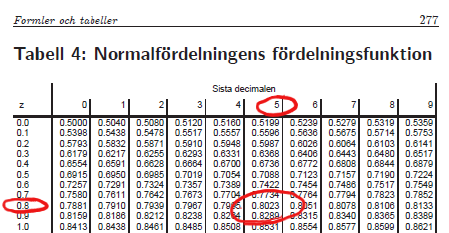
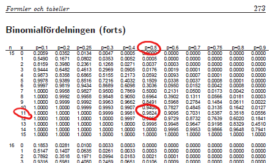

```{r setup, include=FALSE}
knitr::opts_chunk$set(echo = TRUE, warning = F, message = F, error = F)
```

```{r, echo = F}
library(ggplot2)
library(dplyr)
library(cowplot)
library(extrafont)
library(patchwork)
library(tidyr)

theme_set(theme_bw() + theme(plot.background = element_rect(fill = "#ffffe6", color = "#ffffe6"),
                             legend.box.background = element_rect(color = "black")))
```

##

<div style="position:absolute;width:80%;height:400px;border: 10px double;padding: 150px 10px; left:10%; top:100px;">
<p style="text-align:center;font-size: 2em;">
Binomial- och z-test för proportioner
</p>

<p style="text-align:center;">
Motsvarar *Biometri*, kap 8 (exkl. 8.6, 8.8)
</p>
</div>

## I korthet

Vi vill undersöka en variabel (en egenskap) som är **binär**

<div class="fragment fade-in">
Den intressanta populationsparametern är **proportionen** individer med egenskapen ($p$)
</div>

<div class="fragment fade-in">
Med den skattade proportionen $\hat p$ kan vi genomföra hypotestest för $p$, antingen genom ett **binomialtest** eller genom ett **z-test**
</div>

<div class="fragment fade-in">
Vi kan konstruera ett **konfidensintervall** för proportionen $p$
</div>

<div class="fragment fade-in">
Om vi vill jämföra två grupper kan vi använda ett **z-test (eller ett konfidensintervall) för två proportioner**
</div>

# Binära variabler

<div style="width:50%;float:right;left:1200px;top:100px;position:absolute;">
```{r, echo = F, fig.height=6, fig.width = 4}
dat <- data.frame(t = seq(0, 2*pi, length.out = 1000)) %>% 
  mutate(x = cos(t), y = sin(t))
dat_arrow <- data.frame(c = rep(1:3, each = 2),
                        x1 = c(-1 + 0.1, 0, 1 - 0.1),
                        x2 = c(-2/3 + 0.1, 0, 2/3 - 0.1),
                        y1 = c(0,-1 + 0.1, 0),
                        y2 = c(-2,2/3 - 2 - 0.1, -2))

ggplot(dat) +
  geom_polygon(aes(x, y), fill = "#fcc2ff", col = "black") +
  geom_polygon(aes(x / 1.5, y / 1.5 - 2), fill = "#bffcc6", col = "black") +
  geom_segment(aes(x1, y1, xend = x2, yend = y2), data = dat_arrow, 
               arrow = arrow(length = unit(0.30,"cm"), type = "closed")) +
  annotate("text", 0, 0, label = expression("Population (p)"), 
           size = 8, family = "Garamond") +
  annotate("text", 0, -2, label = expression("Stickprov ("*hat(p)*")"), 
           size = 8, family = "Garamond") +
  theme_nothing() +
  theme(panel.background = element_rect(fill = "#ffffe6", color = NA),
        plot.background = element_rect(fill = "#ffffe6", color = NA)) +
  ylim(-3,1)
```
</div>

<div style="width:50%;">
Förekomsten av en egenskap hos en individ är en binär variabel

<div class="fragment fade-in">
Vi vill veta hur vanlig en viss egenskap är i en population (dess proportion $p$)
</div>

<div class="fragment fade-in">
Drar ett stickprov av storlek $n$ och tittar på antalet i stickprovet som har egenskapen (*positiva utfall*)
</div>

<div class="fragment fade-in">
Den naturliga skattningen av $p$ är

$$\hat p = \frac{x}{n}$$

där $x$ är antalet *positiva utfall* och $n$ är stickprovets storlek
</div>
</div>

## Fördelningen för $x$ och $\hat p$

En observation ur populationen är positiv med sannolikheten $p$ och negativ med sannolikheten $1 - p$

<div class="fragment fade-in">
Antalet positiva utfall ($x$) bland $n$ oberoende observationer är summan av $n$ binära variabler
</div>

<div class="fragment fade-in">
Antalet positiva utfall följer därmed en binomialfördelning med storlek $n$ och sannolikhet $p$

$$X \sim Bin(n, p)$$
</div>

<div class="fragment fade-in">
Eftersom *antalet positiva utfall* är binomialfördelat ges fördelningen för $\hat p$ av en binomialfördelning skalad med n
</div>

<div class="fragment fade-in">
<div style="float:right; width:50%;">
```{r, echo = F, fig.height=4, fig.width=8}
g_bin1 <- tibble(x = 0:10, y = dbinom(x, 10, 0.4)) %>% 
  ggplot(aes(x, y)) +
  geom_bar(stat = "identity", width = 0.5) +
  scale_x_continuous(breaks = 0:10) +
  ylab("Sannolikhet") +
  theme(panel.grid.major.x = element_blank(), panel.grid.minor.x = element_blank())

g_bin2 <- tibble(p = 0:10, y = dbinom(p, 10, 0.4)) %>% 
  ggplot(aes(p, y)) +
  geom_bar(stat = "identity", width = 0.5) +
  scale_x_continuous(breaks = 0:10, label = 0:10 / 10) +
  ylab("Sannolikhet") + xlab(expression(hat(p))) +
  theme(panel.grid.major.x = element_blank(), panel.grid.minor.x = element_blank())

g_bin1 + g_bin2
```
</div>
</div>

<div style="font-size:0.75em;">
<br><br>
<div class="fragment fade-in">
Vi drar tio observationer ur en population där 40 procent har antikroppar mot en viss sjukdom
</div>

<div class="fragment fade-in">
Antalet positiva följer en binomalfördelning med $n=10$ och $p = 0.4$
</div>

<div class="fragment fade-in">
Fördelningen för vår skattning av proportionen är en skalning av den binomialfördelningen
</div>
</div>

## Normalapproximation av binomialfördelning

En binomialfördelning kan approximeras med en normalfördelning om $n$ är *stort* och $p$ *nära* $0.5$

<div class="fragment fade-in">
Boken *Biometri* ger tumregeln att $np$ och $n(1-p)$ bägge ska vara större än 10
</div>

<div class="fragment fade-in">
Den skalade binomialfördelningen för $\hat p$ kan approximeras med en normal med $\mu = p$ och $\sigma^2 = \frac{p(1-p)}{n}$
</div>

<div class="fragment fade-in">
```{r, echo = F, fig.align='center', fig.height=4, fig.width=15}
dat_n <- tibble(x = seq(0, 100, 0.1), y = dnorm(x, 40, sqrt(24)))
g_app1 <- ggplot(tibble(x = 0:100, y = dbinom(x, 100, 0.4)), aes(x, y)) +
  geom_bar(stat = "identity", width = 0.5) +
  scale_x_continuous(breaks = seq(0,100,10)) +
  ylab("Sannolikhet") +
  theme(panel.grid.major.x = element_blank(), panel.grid.minor.x = element_blank()) +
  ggtitle("Bin(100, 0.4)")

g_app2 <- g_app1 +
  ggtitle("Skalad binomial") +
  xlab(expression(hat(p))) +
  scale_x_continuous(breaks = seq(0,100,10), labels = seq(0,100,10) / 100)

g_app3 <- g_app1 +
  geom_line(aes(x, y), data = dat_n, col = "red", size = 1) +
  ggtitle("Skalad binomial och N(0.4, 0.0024)") +
  xlab(expression(hat(p))) +
  scale_x_continuous(breaks = seq(0,100,10), labels = seq(0,100,10) / 100)

g_app1 + g_app2 + g_app3
```
</div>

<div class="fragment fade-in" style="font-size:0.75em;">
Fallet med $n = 100$ och $p = 0.4$

<div class="fragment fade-in">
Vi kan antingen basera vårt test på binomialfördelningen för $x$ ($Bin(100, 0.4)$) eller på normalfördelningen för $\hat p$ ($N(0.4, 0.0024)$)
</div>

<div class="fragment fade-in">
Variansen i normalfördelningen ges av $\sigma^2 = \frac{p(1-p)}{n} = \frac{0.4 \cdot 0.6}{100} = 0.0024$
</div>
</div>

# z-test för proportioner, ett stickprov

Ett hypotestest för att jämföra den observerade andelen $\hat p$ med en nollhypotes $p_0$

<div class="fragment fade-in">
Baseras på normalapproximationen av binomialfördelningen
</div>

<div class="fragment fade-in">
Samma tanke som i tidigare test: vi utvärderar en nollhypotes genom att beräkna sannolikheten för datautfallet givet att nollhypotesen stämmer
</div>

<div class="fragment fade-in">
**Standardgången för hypotestest**

>1. Hypoteser
>2. Testfunktion
>3. Testfördelning
>4. p-värde (beräkning eller uppskattning)
>5. Slutsats
</div>

## z-test för proportion, ett stickprov, schema

<div style="position:absolute;height:800px;width:100%;">
<div class="fragment fade-in" style="position:absolute;height:40%;width:30%; background-color:#ffabab;padding:15px;border-radius:15px;">
**Hypoteser**

$H_0: p = p_0$

$H_1: p \neq p_0$
</div>

<div class="fragment fade-in" style="position:absolute;height:40%;width:30%;left:35%;background-color:#fff5ba;padding:15px;border-radius:15px;">
**Testfunktion**

$$z = \frac{\hat p - p_0}{\sqrt {\frac{p_o (1-p_o)}{n}}}$$ 

där $\hat p$ skattas från stickprovet, och $p_0$ hämtas från nollhypotesen
</div>


<div class="fragment fade-in" style="position:absolute;height:40%;width:30%;left:70%;background-color:#bffcc6;padding:15px;border-radius:15px;">
**Testfördelning**

Under nollhypotesen följer $z$ (approximativt) en standardiserad normalfördelning $N(0,1)$

Approximationen är *giltig* om $np_0 > 10$ och $n(1 - p_0) > 10$
</div>


<div class="fragment fade-in" style="position:absolute;height:45%;width:47.5%;left:0%;top:50%;background-color:#ace7ff;padding:15px;border-radius:15px;">
**P-värde**

<div style="float:right;">
```{r, echo = F, fig.align='center', fig.height=2, fig.width=4}
dat <- tibble(z = seq(-5,5,0.01), y = dnorm(z))
ggplot(dat, aes(z, y)) + 
  geom_ribbon(aes(ymax = y, ymin = 0), data = dat %>% filter(z >= 2), fill = "brown1") +
  geom_ribbon(aes(ymax = y, ymin = 0), data = dat %>% filter(z <= -2), fill = "brown1") +
  geom_line() +
  geom_hline(yintercept = 0) +
  ylab("f(z)") +
  labs(title = "Standardiserad normalfördelning, N(0,1)") +
  theme(panel.grid = element_blank(),
        plot.background = element_rect(fill = "#ace7ff", color = "#ace7ff")) +
  scale_x_continuous(breaks = c(-2,0,2), labels = c("-|z|", "0", "|z|"))
```
</div>

P-värdet ges av arean bortom $|z|$ i testfördelningen

Detta kan hämtas ur en normalfördelningstabell (*Biometri*, tabell 4)
</div>

<div class="fragment fade-in" style="position:absolute;height:45%;width:47.5%;left:52.5%;top:50%;background-color:#c5a3ff;padding:15px;border-radius:15px;">
**Svar**

P-värdet ställs mot en förbestämd *signifikansnivå* (ofta 5 procent)

Vid ett lågt p-värde förkastas nollhypotesen

Vid ett högt p-värde förkastas ej nollhypotesen
</div>
</div>

## z-test för proportioner, exempel

Vi undersöker mögelförekomst hos potatis och vill testa om proportionen är skild från $0.3$

Vi drar ett stickprov om $60$ observationer och finner $15$ skadade plantor, så $\hat p = \frac{15}{60} = 0.25$

<div class="fragment fade-in">
**Hypoteser**

$$H_0: p = 0.3 \qquad H_1: p \neq 0.3$$
</div>

<div class="fragment fade-in">
**Testfunktion**

$$z = \frac{\hat p - p_0}{\sqrt {\frac{p_0 (1-p_0)}{n}}} = \frac{0.25 - 0.3}{\sqrt{\frac{0.3 \cdot 0.7}{60}}} = -0.8452$$
</div>

<div class="fragment fade-in">
**Testfördelning**

Under nollhypotesen följer $z$ en standardiserad normalfördelning, $N(0,1)$
</div>

## 

**P-värde**

<div class="fragment fade-in" style="float:right;width:50%;">
```{r, echo = F, fig.height = 4, fig.width=8, fig.align='center'}
dat <- tibble(x = seq(-4,4,0.01), y = dnorm(x))

x_val <- -0.8452

g1 <- ggplot(dat, aes(x, y)) +
  geom_ribbon(aes(ymin = 0, ymax = y), fill = "brown1", data = dat %>% filter(x < x_val)) +
  geom_ribbon(aes(ymin = 0, ymax = y), fill = "brown1", data = dat %>% filter(x > abs(x_val))) +
  geom_line() +
  scale_x_continuous(breaks = c(-4, -0.8452, 0, 0.8452, 4))
g1
```


</div>

Testfunktionens värde $z = -0.8452$

<div class="fragment fade-in" style="width:50%;">
Svanssannolikheten kan beräknas genom att slå i en normalfördelningstabell

<div class="fragment fade-in">
Tabellen ger sannolikheten $0.8023$ (för $z = 0.85$)
</div>

<div class="fragment fade-in">
*En* svans motsvarar därmed $1 - 0.8023 = 0.1977$
</div>

<div class="fragment fade-in">
Det tvåsidiga p-värdet ges av $2 \cdot 0.1977 = 0.3954$
</div>

<div class="fragment fade-in">
**Slutsats**

Det höga p-värdet ger att vi inte förkastar nollhypotesen

<div class="fragment fade-in">
Det finns ingen säkerställd skillnad mot nollhypotesens värde $0.3$
</div>
</div>
</div>

## Konfidensintervall för proportioner, ett stickprov

Konfidensintervallet baseras på tabellvärden från den standardiserade normalfördelningen

<div class="fragment fade-in">
**Formel**

Det tvåsidiga konfidensintervallet ges av

$$\hat p \pm z_{(1-\alpha/2)} \sqrt{\frac{\hat p (1 - \hat p)}{n}}$$
</div>

<div class="fragment fade-in">
Fortsättning från tidigare exempel

$$0.25 \pm 1.96 \sqrt{\frac{0.25 \cdot 0.75}{60}}$$

Detta ger intervallet $(0.140, 0.360$)
</div>

# Binomialtestet

<div class="fragment fade-in" style="float:right;width:50%;">
```{r, echo = F, fig.height = 7.5, fig.width=8, fig.align='center'}
dat <- data.frame(x = 0:60, y = dbinom(0:60, 60, 0.3))
g1 <- ggplot(dat, aes(x, y, fill = x != 15)) +
  geom_bar(stat="identity", width = 0.4) +
  ylab("f(x)") + xlab("x") +
  theme(legend.position = "none") +
  ggtitle("Observerat utfall")

g3 <- ggplot(dat, aes(x, y, fill = x > 15)) +
  geom_bar(stat="identity", width = 0.4) +
  ylab("f(x)") + xlab("x") +
  theme(legend.position = "none") +
  ggtitle("Medräknade staplar vid ensidig mothypotes")

g2 <- ggplot(dat, aes(x, y, fill = y > y[16])) +
  geom_bar(stat="identity", width = 0.4) +
  ylab("f(x)") + xlab("x") +
  theme(legend.position = "none") +
  ggtitle("Medräknade staplar vid tvåsidig mothypotes")

g1 / g3 / g2
```
</div>

Proportioner kan också testas genom binomialfördelningen

<div class="fragment fade-in" style="width:50%;">
Under nollhypotesen följer antalet skadade växter en binomialfördelning $Bin(60, 0.3)$

Vi observerar 15 skadade växter
</div>

<div class="fragment fade-in" style="width:50%;">
Det ensidiga p-värdet (vid $H_1: p < 0.3$) är sannolikheten att få 15 eller färre skadade växter
</div>

<div class="fragment fade-in" style="width:50%;">
Det tvåsidiga p-värdet (vid $H_1: p \neq 0.3$) är den summerade sannolikheten för utfall som är mindre sannolika än det observerade resultatet

Detta motsvarar alla staplar som är lägre än stapeln vid 15
</div>

<div class="fragment fade-in" style="width:50%;">
Sannolikheterna kan beräknas i valfritt datorprogram, vilket ger $0.2438$ respektive $0.4816$
</div>

## Binomialtestet, schema

<div style="position:absolute;height:800px;width:100%;">
<div class="fragment fade-in" style="position:absolute;height:35%;width:30%; background-color:#ffabab;padding:15px;border-radius:15px;">
**Hypoteser**

$H_0: p = p_0$

$H_1: p \neq p_0$ 
</div>

<div class="fragment fade-in" style="position:absolute;height:35%;width:30%;left:35%;background-color:#fff5ba;padding:15px;border-radius:15px;">
**Testfunktion**

$$x = \text{ antalet positiva utfall}$$
</div>


<div class="fragment fade-in" style="position:absolute;height:35%;width:30%;left:70%;background-color:#bffcc6;padding:15px;border-radius:15px;">
**Testfördelning**

Under nollhypotesen följer $x$ en binomialfördelning med parameterar $n$ och $p_0$: $Bin(n, p_0)$
</div>


<div class="fragment fade-in" style="position:absolute;height:50%;width:47.5%;left:0%;top:45%;background-color:#ace7ff;padding:15px;border-radius:15px;">
**P-värde**

<div style="float:right;">
```{r, echo = F, fig.align='center', fig.height=2, fig.width=4}
dat <- tibble(x = 0:10, y = dbinom(x, 10, 0.3), id = x < 6 & x > 0)
ggplot(dat, aes(x, y, fill = id)) + 
  geom_bar(stat = "identity") +
  geom_hline(yintercept = 0) +
  ylab("p(x)") +
  labs(title = "Binomialfördelning, Bin(10,0.3)") +
  theme(legend.position = "none", 
        panel.grid = element_blank(),
        plot.background = element_rect(fill = "#ace7ff", color = "#ace7ff")) +
  scale_x_continuous(breaks = c(0, 6, 10), labels = c(0, "x", 10))
```
</div>

P-värdet ges av summan av de utfall som är mindre sannolika än $x$

Detta kan hämtas ur en binomialfördelningstabell (*Biometri*, tabell 2, för $n \leq 20$)
</div>

<div class="fragment fade-in" style="position:absolute;height:50%;width:47.5%;left:52.5%;top:45%;background-color:#c5a3ff;padding:15px;border-radius:15px;">
**Svar**

P-värdet ställs mot en förbestämd *signifikansnivå* (ofta 5 procent)

Vid ett lågt p-värde förkastas nollhypotesen

Vid ett högt p-värde förkastas ej nollhypotesen
</div>
</div>

## Binomialtest, exempel

Vid straffavgöranden i fotboll slår lagen varannan straff

<div class="fragment fade-in">
Eftersom de flesta straffar blir mål är den psykologiska bördan större på det lag som går som tvåa
</div>

<div class="fragment fade-in">
I herr-VM (1998 till 2014) vann det första laget 12 av 15 straffavgöranden ($\hat p = 12 / 15 = 0.8$)
</div>

<div class="fragment fade-in">
Kan vi säga att vinstsannolikheten för det lag som går först är större än 0.5?
</div>

<div class="fragment fade-in">
**Hypoteser**

$H_0: p = 0.5$

$H_1: p > 0.5$
</div>

<div class="fragment fade-in">
**Testfunktion**

Antalet positiva utfall är $x = 12$ av $n = 15$
</div>

<div class="fragment fade-in">
**Testfördelning**

Under nollhypotesen kommer vår observation från en binomialfördelning med $n = 15$ och $p = 0.5$
</div>

##

**p-värde**

<div class="fragment fade-in" style="width:50%; float:right;">
```{r, echo = F, fig.align='center', fig.height=4}
tibble(x = 0:15, y = dbinom(x, 15, 0.5), id = x < 12) %>% 
  ggplot(aes(x, y, fill = id)) +
  geom_bar(stat = "identity", col = "black") +
  ylab("Sannolikhet") +
  theme(legend.position = "none") +
  ggtitle("Bin(n = 15, p = 0.5)") +
  scale_x_continuous(breaks = c(0, 5, 10, 12, 15))
```


</div>

<div class="fragment fade-in" style="width:50%;">
p-värdet beräknas som sannolikheten för det observerade utfallet eller något mer extremt

<div class="fragment fade-in">
I det här fallet sannolikheten att få $12$ eller fler positiva utfall
</div>

<div class="fragment fade-in">
Tabell 2 ger sannolikheten för värden mindre eller lika med värdet i vänstra kolumnen
</div>

<div class="fragment fade-in">
Sannolikheten att få mindre än eller lika med 11 är $0.9824$
</div>

<div class="fragment fade-in">
Sannolikheten att få mer eller lika med 12 är därmed $1 - 0.9824 = 0.0176$
</div>
</div>

<div class="fragment fade-in">
**Slutsats**

Det finns en statistiskt säkerställd skillnad från $0.5$
</div>

<div class="fragment fade-in">
Detta tyder på att sannolikheten att vinna är större om man går först
</div>

<div class="fragment fade-in">
*Bonusuppgift. Vid VM 2018 förlorade förstalaget samtliga av fyra straffläggningar. Är resultatet fortfarande signifikant om den datan tas med?*
</div>

# z-test för två proportioner

Liknande generalisering som t-testet med två prov

<div class = "fragment fade-in">
Vi har två prover av binära data och kan uppskatta tre proportioner
</div>

<div class = "fragment fade-in">
$\hat p_1$ och $\hat p_2$ är proportionerna från respektive stickprov

$\hat p_0$ är proportionen från det sammanslagna stickprovet
</div>

## z-test för proportioner, två stickprov, schema

<div style="position:absolute;height:800px;width:100%;">
<div class="fragment fade-in" style="position:absolute;height:40%;width:30%; background-color:#ffabab;padding:15px;border-radius:15px;">
**Hypoteser**

$H_0: p_1 = p_2$

$H_1: p_1 \neq p_2$
</div>

<div class="fragment fade-in" style="position:absolute;height:40%;width:30%;left:35%;background-color:#fff5ba;padding:15px;border-radius:15px;">
**Testfunktion**

$z = \frac{\hat p_1 - \hat p_2}{\sqrt {\hat p_0 (1-\hat p_0) (\frac{1}{n_1} + \frac{1}{n_2})}}$

där $\hat p_0 = \frac{n_1 \hat p_1 + n_2 \hat p_2}{n_1 + n_2}$

och $\hat p_1$ och $\hat p_2$ skattas
</div>


<div class="fragment fade-in" style="position:absolute;height:40%;width:30%;left:70%;background-color:#bffcc6;padding:15px;border-radius:15px;">
**Testfördelning**

Under nollhypotesen följer $z$ en standardiserad normalfördelning

Tumregel: $n_1 \hat p_0, n_2 \hat p_0, n_1(1-\hat p_0)$ och $n_2(1-\hat p_0)$ bör alla vara större än $10$
</div>


<div class="fragment fade-in" style="position:absolute;height:45%;width:47.5%;left:0%;top:50%;background-color:#ace7ff;padding:15px;border-radius:15px;">
**P-värde**

<div style="float:right;">
```{r, echo = F, fig.align='center', fig.height=2, fig.width=4}
dat <- tibble(z = seq(-5,5,0.01), y = dnorm(z))
ggplot(dat, aes(z, y)) + 
  geom_ribbon(aes(ymax = y, ymin = 0), data = dat %>% filter(z >= 2), fill = "brown1") +
  geom_ribbon(aes(ymax = y, ymin = 0), data = dat %>% filter(z <= -2), fill = "brown1") +
  geom_line() +
  geom_hline(yintercept = 0) +
  ylab("f(z)") +
  labs(title = "Standardiserad normalfördelning, N(0,1)") +
  theme(panel.grid = element_blank(),
        plot.background = element_rect(fill = "#ace7ff", color = "#ace7ff")) +
  scale_x_continuous(breaks = c(-2,0,2), labels = c("-|z|", "0", "|z|"))
```
</div>

P-värdet ges av arean bortom $|z|$ i testfördelningen

Detta kan hämtas ur en normalfördelningstabell (*Biometri*, tabell 4)
</div>

<div class="fragment fade-in" style="position:absolute;height:45%;width:47.5%;left:52.5%;top:50%;background-color:#c5a3ff;padding:15px;border-radius:15px;">
**Svar**

P-värdet ställs mot en förbestämd *signifikansnivå* (ofta 5 procent)

Vid ett lågt p-värde förkastas nollhypotesen

Vid ett högt p-värde förkastas ej nollhypotesen
</div>
</div>

## Två stickprov, exempel

Träd i södra och norra Sverige kontrolleras för en viss sjukdom

$50$ av $100$ är sjuka i söder och $52$ av $200$ är sjuka i norr

<div class="fragment fade-in">
$$\hat p_1 = \frac{50}{100} = 0.50 \qquad \hat p_2 = \frac{52}{200} = 0.26$$
</div>

<div class="fragment fade-in">
Vi vill testa om regionerna har skilda proportioner sjuka träd
</div>

<div class="fragment fade-in">
Den sammanslagna proportionen är $\hat p_0 = \frac{50+52}{100+200} = 0.34$
</div>

<div class="fragment fade-in">
**Hypoteser**

$$H_0: p_1 = p_2 \qquad H_1: p_1 \neq p_2$$
</div>

<div class="fragment fade-in">
**Testfunktion**

$$z = \frac{\hat p_1 - \hat p_2}{\sqrt {\hat p_0 (1- \hat p_0) (\frac{1}{n_1} + \frac{1}{n_2})}} = \frac{0.50 - 0.26}{\sqrt{0.34 (1 - 0.34)\left( \frac{1}{100} + \frac{1}{200}  \right)}} = 4.137$$
</div>

##

**Testfördelning**

<div class="fragment fade-in">
Under nollhypotesen följer $z$ en standardiserad normalfördelning $N(0,1)$
</div>

<div class="fragment fade-in">
**P-värde**
</div>

<div class="fragment fade-in" style="float:right;width:50%;">
```{r, echo = F, fig.height = 4, fig.width=8, fig.align='center'}
dat <- tibble(x = seq(-5,5,0.01), y = dnorm(x))

x_val <- 4.137

g1 <- ggplot(dat, aes(x, y)) +
  geom_ribbon(aes(ymin = 0, ymax = y), fill = "brown1", data = dat %>% filter(x < -abs(x_val))) +
  geom_ribbon(aes(ymin = 0, ymax = y), fill = "brown1", data = dat %>% filter(x > abs(x_val))) +
  geom_line() +
  scale_x_continuous(breaks = c(-5, -4.137, 0, 4.137, 5))
g1
```
</div>

<div class="fragment fade-in" style="width:50%;">
p-värdet ges av arean under kruvan bortom $z = 4.137$ 

<div class="fragment fade-in">
I det här fallet är den arean mycket liten
</div>

<div class="fragment fade-in">
Normalfördelningstabellen (*Biometri*, tabell 4) ger att p-värdet i alla fall är mindre än $0.001$
</div>
</div>

<div class="fragment fade-in">
**Slutsats**

Ett lågt p-värde ger att vi förkastar nollhypotesen

Det finns en statistiskt säkerställd skillnad mellan proportionerna sjuka träd
</div>

## Två stickprov, konfidensintervall

Konfidensintervallet för skillnaden mellan proportioner ges av

$$\hat p_1 - \hat p_2 \pm z_{(1-\alpha/2)} \sqrt{\hat p_0 (1 - \hat p_0)\left( \frac{1}{n_1} + \frac{1}{n_2}  \right)}$$

Ett 95-procentigt konfidensintervall för exemplet

$$0.5-0.26 \pm 1.96 \sqrt{0.34 \cdot 0.66 (0.01 + 0.005)} = 0.24 \pm 0.11$$

eller $(0.13,0.35)$

# Antagandet

Binomaltestet och z-testerna bygger på oberoende observationer

z-testerna bygger dessutom på en giltig normalapproximation

#

<div style="position:absolute;width:80%;height:400px;border: 10px double;padding: 150px 10px; left:10%; top:100px;">
<p style="text-align:center;font-size: 2em;">
Slut
</p>
</div>