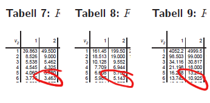

```{r setup, include=FALSE}
knitr::opts_chunk$set(echo = TRUE, warning = F, message = F, error = F)
```

```{r, echo = F}
library(ggplot2)
library(dplyr)
library(cowplot)
library(extrafont)
library(patchwork)
library(tidyr)
library(forcats)
library(emmeans)

theme_set(theme_bw() + theme(plot.background = element_rect(fill = "#ffffe6", color = "#ffffe6"),
                             legend.box.background = element_rect(color = "black")))
```

##

<div style="position:absolute;width:80%;height:400px;border: 10px double;padding: 150px 10px; left:10%; top:100px;">
<p style="text-align:center;font-size: 2em;">
Variansanalys
</p>

<p style="text-align:center;">
Motsvarar *Biometri*, kap 10
</p>
</div>

# I korthet

<div class="fragment fade-in">
t-testet kan testa om två stickprov av kontinuerlig data har samma medelvärde
</div>

<div class="fragment fade-in">
Naturlig utveckling att vilja testa **fler än två** stickprov
</div>

<div class="fragment fade-in">
Möjligt genom **variansanalys** (eller ANalysis Of VAriance, *Anova*)
</div>

<div class="fragment fade-in">
Genom variansanalys kan man testa om det finns *någon* skillnad mellan grupper genom ett **F-test**
</div>

<div class="fragment fade-in">
Man kan även testa om *två* valda grupper är skilda med hjälp av **LSD** <span class="fragment fade-in">**(Least Significant Difference)**</span>
</div>

## Exempeldata

Testar en ärtgrödas reaktion på planteringstäthet.

<div class="fragment fade-in">
Tre behandlingar: tät, mellan och gles
</div>

<div class="fragment fade-in">
Utfallsvariabeln $y$ är torrvikt i kilo per skörderuta
</div>

<div class="fragment fade-in">
```{r, echo = F, fig.height = 6}
dat <- tibble(Behandling = rep(c("Tät", "Mellan", "Gles"), each = 3),
              y = c(2,7,6, 
                    12,13,11,
                    11,15,13)) %>% 
  mutate(`Overall mean` = mean(y)) %>% 
  group_by(Behandling) %>% 
  mutate(`Group mean` = mean(y)) %>% 
  mutate(`Residual, overall mean` = y - `Overall mean`,
         `Residual, group mean` = y - `Group mean`,
         `Squared residual, overall mean` = `Residual, overall mean`^2,
         `Squared residual, group mean` = `Residual, group mean`^2)

dat %>% 
  select(Behandling, y) %>% 
  knitr::kable()
```
</div>

## Illustration

<div style="position:absolute;width:50%;">
```{r, echo = F, fig.height = 7}
dat_n <- tibble(x = seq(-10, 10, 0.01),
                y = dnorm(x))
dat_n <- dat_n[c(1:2001, 1:2001, 1:2001),]
dat_n$Behandling <- rep(c("Tät", "Mellan", "Gles"), each = 2001)
dat_n$mean <- rep(c(5, 12, 13), each = 2001)
dat_n$sd <- summary(lm(y ~ Behandling, dat))$sigma

g_m <- ggplot(dat, aes(y, 0)) +
  geom_point(size = 3) +
  #  geom_line(aes(sd * x + mean, y), data = dat_n) +
  facet_wrap(~ Behandling, ncol = 1) +
  xlab("Vikt") + ylab("") +
  theme(axis.ticks.y = element_blank(), axis.text.y = element_blank()) +
  coord_cartesian(xlim = c(0, 20), ylim = c(-0.1,0.5))
g_m
```
</div>

<div style="position:absolute;width:50%;left:50%">
<br><br>
Varje behandling innefattar tre observationer
</div>

## Illustration

<div style="position:absolute;width:50%;">
```{r, echo = F, fig.height = 7}
g_m + 
  geom_line(aes(sd * x + mean, y), data = dat_n)
```
</div>

<div style="position:absolute;width:50%;left:50%">
<br><br>
I en anova-modell är observationerna normalfördelade kring ett gruppspecifikt medelvärde

<div class="fragment fade-in">
Det gruppspecifika medelvärdet skattas med det observerade medelvärdet för gruppen
</div>
</div>

## Modellekvation

En observation är summan av

>- ett övergripande medelvärde $\mu$
>- en behandlingseffekt $\alpha$
>- en slumpmässig felterm $e$

<div class="fragment fade-in">
Detta kan uttryckas

$$y_{ij} = \mu + \alpha_i + e_{ij} \qquad e_{ij} \sim N(0,\sigma_e^2)$$

$$i=1,...,a \qquad j=1,...,n$$
</div>

# Anova-tabell

Egenskaper hos en skattad anova-modell sammanfattas ofta i en anova-tabell

<div class="fragment fade-in" data-fragment-index="1">
Anova-tabellen ger en uppdelning av variationen i en del *mellan* grupper och en del *inom* grupper
</div>

<div class="fragment fade-in" data-fragment-index="2">
**Kvadratsummor**
</div>

<div class="fragment fade-in" data-fragment-index="3" style="float:right; width: 50%;">
```{r, echo = F, fig.height = 5, fig.align='center'}
g_o <- ggplot(dat, aes(y, 0)) +
  geom_point() +
  geom_vline(aes(xintercept = `Overall mean`)) +
  facet_wrap(~ Behandling, ncol = 1) +
  ylab("") + xlab("") +
  theme(axis.text.y = element_blank(), axis.ticks.y = element_blank()) +
  labs(title = "Observationer och övergripande medelvärde")

g_g <- ggplot(dat, aes(y, 0)) +
  geom_point() +
  geom_vline(aes(xintercept = `Group mean`), linetype = 2) +
  facet_wrap(~ Behandling, ncol = 1) +
  ylab("") + xlab("") +
  theme(axis.text.y = element_blank(), axis.ticks.y = element_blank()) +
  labs(title = "Observationer och gruppmedelvärde")

g_o + g_g
```
</div>

<div class="fragment fade-in" data-fragment-index="3">
Variansanalys bygger på beräknade kvadratsummor
</div>

<div class="fragment fade-in" data-fragment-index="4">
Datan ger skattningar för ett övergripande medelvärde och ett gruppmedelvärde
</div>

<div class="fragment fade-in" data-fragment-index="5">
Summan av kvadrerade avstånd mellan observationen och det övergripande medelvärdet ger en kvadratsumma för totalen $SS_T$
</div>

<div class="fragment fade-in" data-fragment-index="6">
Summan av kvadrerade avstånd mellan observationen och gruppmedelvärdet ger en kvadratsumma för slumpfelet $SS_e$
</div>

<div class="fragment fade-in" data-fragment-index="7">
Differensen mellan $SS_T$ och $SS_e$ betecknas $SS_A$ $$SS_A = SS_T - SS_e$$
</div>

## Kvadratsummor, exempel, $SS_T$

<div style="float:right;">
```{r, echo = F, fig.height = 5, fig.align='center'}
g_o
```
</div>

```{r, echo = F}
dat %>% 
  select(Behandling, y, `Overall mean`, `Residual, overall mean`, `Squared residual, overall mean`) %>% 
  `names<-`(c("Behandling", "Utfall", "Övergripande medel", "Residual", "Kvadrerad residual")) %>% 
  knitr::kable()
```

$SS_T$ är summan av kvadrerade residualer $SS_T = 138$

## Kvadratsummor, exempel, $SS_e$

<div style="float:right;">
```{r, echo = F, fig.height = 5, fig.align='center'}
g_g
```
</div>


```{r, echo = F}
dat %>% 
  select(Behandling, y, `Group mean`, `Residual, group mean`, `Squared residual, group mean`) %>% 
  `names<-`(c("Behandling", "Utfall", "Gruppmedel", "Residual", "Kvadrerad residual")) %>% 
  knitr::kable()
```

$SS_T$ är summan av kvadrerade residualer $SS_e = 24$

## Frihetsgrader

Antalet frihetsgrader för en kvadratsumma ges av antalet observationer minus antalet skattade parametrar

<div class="fragment fade-in">
Vid beräkningen av den totala kvadratsumman $SS_T$ används en skattad parameter. antalet frihetsgrader är alltså $N - 1$
</div>

<div class="fragment fade-in">
Vid beräkningen av kvadratsumman för slumpfelet skattas en parameter per grupp. För $a$ stycken grupper ges antalet frihetsgrader därmed av $N - a$
</div>

<div class="fragment fade-in">
Skillnaden i antalet frihetsgrader är antalet frihetsgrader som tillskrivs $SS_A$: $(N - 1) - (N - a) = a - 1$, det vill säga antalet grupper minus ett
</div>

## Anova-tabell

Modellens resultat sammanfattas i en *Anova-tabell*

<div class="fragment fade-in">
Anova-tabellen innehåller information om kvadratsummor (SS) och frihetsgrader (fg), utifrån dessa beräknas medelkvadratsummor (MS), F-värden, och p-värden
</div>

<div class="fragment fade-in">
Generellt schema

|          |    Df|Sum Sq (SS)|Mean Sq (MS)|           F|  p-value|
|:--------------|-----:|----------:|-----------:|-----------:|--------:|
|Behandling (A)| $a-1$|     $SS_A$|$SS_A/(a-1)$| $MS_A/MS_e$|         |
|Residual   (e)| $N-a$|     $SS_e$|$SS_e/(N-a)$|            |         |
|Total      (T)| $N-1$|     $SS_T$|$SS_T/(N-1)$|            |         |
</div>

## Anova-tabell, exempel

<div style="width:1500px">
<div class="fragment fade-in" style="height:250px">
<div style="float:right; width:750px;font-size:0.8em;">

|          |    Df|Sum Sq (SS)|Mean Sq (MS)|           F|  p-value|
|:--------------|-----:|----------:|-----------:|-----------:|--------:|
|Behandling (A)| $3-1$|     $SS_A$|$SS_A/(a-1)$| $MS_A/MS_e$|         |
|Residual   (e)| $9-3$|     $SS_e$|$SS_e/(N-a)$|            |         |
|Total      (T)| $9-1$|     $SS_T$|$SS_T/(N-1)$|            |         |

</div>
I vårt exempel har vi tre behandlingar och nio observationer ($N = 9$ och $a = 3$)
</div>

<div class="fragment fade-in" style="height:250px">
<div style="float:right; width:750px;font-size:0.8em;">

|          |    Df|Sum Sq (SS)|Mean Sq (MS)|           F|  p-value|
|:--------------|-----:|----------:|-----------:|-----------:|--------:|
|Behandling (A)| $2$|     $114$|$SS_A/(a-1)$| $MS_A/MS_E$|         |
|Residual   (e)| $6$|      $24$|$SS_e/(N-a)$|            |         |
|Total      (T)| $8$|     $138$|$SS_T/(N-1)$|            |         |

</div>
Vi har tidigare beräknat kvadratsummorna $SS_T = 138$ och $SS_e = 24$. 

$SS_A$ ges av differensen $138-24 = 114$.
</div>

<div class="fragment fade-in" style="height:250px">
<div style="float:right; width:750px;font-size:0.8em;">

|          |    Df|Sum Sq (SS)|Mean Sq (MS)|           F|  p-value|
|:--------------|-----:|----------:|-----------:|-----------:|--------:|
|Behandling (A)| $2$|     $114$|$57$| $MS_A/MS_e$|         |
|Residual   (e)| $6$|      $24$|$4$|            |         |
|Total      (T)| $8$|     $138$|$17.25$|            |         |

</div>
Medelkvadratsummorna MS ges av kvadratsumman delat på antalet frihetsgrader

</div>
</div>

# F-test

*Har alla grupper samma populationsmedelvärde?*

Testas med ett F-test

<div class="fragment fade-in">
Samma gång som tidigare hypotestest (HTTPS)
</div>

<div class="fragment fade-in">
Testfunktionen hämtas från anova-tabellen
</div>

<div class="fragment fade-in">
Testfördelningen är en F-fördelning
</div>

## F-fördelning

Tester av kvadratsummor baseras på en testfördelning som kallas en F-fördelning

<div class="fragment fade-in" style="float:right;width:50%;">
```{r, echo = F, fig.height=5, fig.align='center'}
dat_f <- expand.grid(x = seq(0, 10, 0.01), df1 = c(3), df2 = c(1,5,12))
dat_f$y <- df(dat_f$x, dat_f$df1, dat_f$df2)
dat_f$df <- paste0("df1 = ", dat_f$df1, ", df2 = ", dat_f$df2)

ggplot(dat_f, aes(x, y, col = df)) + 
  geom_line(size = 1.2) + 
  ylim(0,1)
```
</div>

<div class="fragment fade-in">
<br><br>
En F-fördelning uppstår som kvoten av två $\chi^2$-fördelade slumpvariabler

Den defineras av två parametrar, antalet *frihetsgrader i täljaren* $\nu_1$, och antalet *frihetsgrader i nämnaren* $\nu_2$
</div>

## Biometri, tabell 8 (och 7, 9, 10)

Som tidigare kommer vi vilja uppskatta svanssannolikheten

<div class="fragment fade-in">
```{r, echo = F, fig.align='center', fig.width=16, fig.height=3.5}
dat_f <- expand.grid(p = c(0.90, 0.95, 0.99), x = seq(0,12,0.01))
dat_f <- dat_f %>% 
  arrange(p, x) %>% 
  mutate(q = qf(p, 2, 6),
         y = df(x, 2, 6))
dat_q <- dat_f

for(j in c(0.90, 0.95, 0.99)){
  dat_f <- dat_q %>% filter(p == j)
  g_temp <- ggplot(dat_f, aes(x, y)) +
    geom_line() +
    geom_hline(yintercept = 0) +
    geom_vline(xintercept = 0) +
    geom_ribbon(aes(ymin = 0, ymax = y), data = dat_f %>% filter(x > q), fill = "brown1") +
    geom_line() +
    theme(panel.grid = element_blank(), axis.text.y = element_blank(), axis.ticks.y = element_blank(), axis.title.y = element_blank()) +
    scale_x_continuous(breaks = round(c(0, unique(dat_f$q)), 3),
                       labels = round(c(0, unique(dat_f$q)), 3)) +
    ggtitle(paste0(round(100 * (1 - j), 1), " procent i svansen")) +
    xlab("")
  assign(paste0("g", j), g_temp)
}

(g0.9 | g0.95 | g0.99) + 
  plot_annotation(title = "Svanssannolikheter i en F-fördelning med 2/6 frihetsgrader")
```
</div>

<div class="fragment fade-in">
Tabellvärden för x-axeln betecknas $F_{(1-\alpha, \nu_1, \nu_2)}$ och kan hämtas från en tabell över F-fördelningen
</div>

<div class="fragment fade-in">
F-fördelningen delas i flera tabeller, beroende på värdet för $\alpha$
</div>

<div class="fragment fade-in" style="float:left; width: 40%;">

</div>

<div class="fragment fade-in">
Kolumnen ges av $\nu_1$ och raden av $\nu_2$
</div>

<div class="fragment fade-in">
För ett tabellvärde motsvarande fem procent i svansen och frihetsgrader 2 och 6, tittar vi i tabell 8 för $F_{(0.95, 2, 6)} = 5.143$
</div>

## F-test, schema

<div style="position:absolute;height:800px;width:100%;font-size:0.9em;">
<div class="fragment fade-in" style="position:absolute;height:40%;width:30%; background-color:#ffabab;padding:15px;border-radius:15px;">
**Hypoteser**

$H_0: \mu_1 = \mu_2 = ... = \mu_a$ alla grupper har samma medelvärde

$H_1:$ det finns skillnad i medelvärde mellan några grupper
</div>

<div class="fragment fade-in" style="position:absolute;height:40%;width:30%;left:35%;background-color:#fff5ba;padding:15px;border-radius:15px;">
**Testfunktion**

$$F = \frac{MS_A}{MS_e}$$ 

där $MS_A$ och $MS_e$ hämtas från anova-tabellen
</div>

<div class="fragment fade-in" style="position:absolute;height:40%;width:30%;left:70%;background-color:#bffcc6;padding:15px;border-radius:15px;">
**Testfördelning**

Under nollhypotesen följer $F$ en F-fördelning med $\nu_1$ och $\nu_2$ frihetsgrader

I den enkla anova-modellen gäller $\nu_1 = a - 1$ och $\nu_2 = N - a$
</div>

<div class="fragment fade-in" style="position:absolute;height:50%;width:47.5%;left:0%;top:50%;background-color:#ace7ff;padding:15px;border-radius:15px;">
**P-värde**

<div style="float:right;">
```{r, echo = F, fig.align='center', fig.height=2, fig.width=4}
dat_temp <- dat
dat <- tibble(x = seq(0,15,0.01), y = df(x, 4, 12))
ggplot(dat, aes(x, y)) + 
  geom_ribbon(aes(ymax = y, ymin = 0), data = dat %>% filter(x >= 3), fill = "brown1") +
  geom_line() +
  geom_hline(yintercept = 0) +
  ylab("f(x)") +
  labs(title = "F-fördelning, a-1 och N-a fg") +
  theme(panel.grid = element_blank(),
        plot.background = element_rect(fill = "#ace7ff", color = "#ace7ff")) +
  scale_x_continuous(breaks = c(0,3), labels = c(0, "F"))

dat <- dat_temp
```
</div>

P-värdet ges av arean bortom F i testfördelningen

Vid handräkning uppskattas p-värdet genom att ställa F mot ett tabellvärde
</div>

<div class="fragment fade-in" style="position:absolute;height:50%;width:47.5%;left:52.5%;top:50%;background-color:#c5a3ff;padding:15px;border-radius:15px;">
**Svar**

P-värdet ställs mot en förbestämd *signifikansnivå* (ofta 5 procent)

Vid ett lågt p-värde förkastas nollhypotesen

Vid ett högt p-värde förkastas ej nollhypotesen
</div>
</div>

## F-test, exempel

Vi beräknade tidigare följande anova-tabell

|          |    Df|Sum Sq (SS)|Mean Sq (MS)|           F|  p-value|
|:---------|-----:|----------:|-----------:|-----------:|--------:|
|Behandling (A)| $2$|     $114$|$57$| $MS_A/MS_e$|         |
|Residual   (e)| $6$|      $24$|$4$|            |         |
|Total      (T)| $8$|     $138$|$17.25$|            |         |

<div class="fragment fade-in">
**Hypoteser**

$H_0:$ ingen skillnad mellan behandlingar

$H_1:$ någon skillnad mellan behandlingar
</div>

<div class="fragment fade-in">
**Testfunktion**

$$F_{obs} = \frac{MS_A}{MS_e} = \frac{57}{4} = 14.25$$

$MS_A$ och $MS_e$ kan hämtas från anova-tabellen
</div>

##

**Testfördelning**

<div class="fragment fade-in">
Under nollhypotesen följer $F$ en F-fördelning med $\nu_1 = 2$ och $\nu_2 = 6$
</div>

<div class="fragment fade-in">
**P-värde**

<div style="float:right;">
```{r, echo = F, fig.height = 4, fig.align='center'}
dat_f <- tibble(x = seq(0.01, 20, 0.01), y = df(x, 2, 6))
ggplot(dat_f, aes(x, y)) + 
  geom_line() +
  geom_ribbon(aes(x, ymax = y, ymin = 0), data = dat_f %>% filter(x >= 14.25), fill = "red") +
  xlab("") +ylab("") +
  scale_x_continuous(breaks = 14.25) +
  ggtitle("F-fördelning med 2 och 6 frihetsgrader")
```


</div>

P-värdet ges av ytan till höger om vårt observerade $F = 14.25$
</div>

<div class="fragment fade-in">
Vi kan uppskatta p-värdet från *Biometri* tabell 6
</div>

<div class="fragment fade-in">
Vårt observerade värde ligger över $F_{(0.99, 2, 6)} = 10.925$. P-värdet måste alltså vara under $1$ procent
</div>

<div class="fragment fade-in">
En datorberäkning ger det exakta värdet $0.00526$
</div>

<div class="fragment fade-in">
**Slutsats**

P-värdet är under $5$ procent, vilket ger att vi förkastar nollhypotesen

Det finns någon statistiskt säkerställd skillnad i populationsmedelvärde mellan behandlingarna
</div>

# Parvisa jämförelser

Signifikans i F-testet ger att det finns *någon* skillnad mellan behandlingar

<div class="fragment fade-in">
Vari ligger skillnaden?

```{r, echo = F, fig.align='center', fig.height=6}
g_g
```
</div>

## Minsta signifikanta skillnad

Ett konfidensintervall för skillnaden mellan två gruppmedelvärden ges av

$$\bar{x_1} - \bar{x_2} \pm t_{(0.975, df_e)} \sqrt{MS_e (\frac{1}{n_1} + \frac{1}{n_2})}$$
<br>

<div class="fragment fade-in">
Den sista termen kallas minsta signifikanta skillnad (*(Fisher's) Least Significant Difference, LSD*)

$$LSD = t_{(0.975, df_e)} \sqrt{MS_e (\frac{1}{n_1} + \frac{1}{n_2})}$$
</div>

<br>

<div class="fragment fade-in">
Om skillnaden mellan två gruppers medelvärden överstiger LSD är grupperna signifikant skilda på fem-procentsnivån
</div>

## Minsta signifikanta skillnad, exempel

<div style="float:right; width:750px">

|          |    Df|Sum Sq (SS)|Mean Sq (MS)|           F|  p-value|
|:---------|-----:|----------:|-----------:|-----------:|--------:|
|Behandling| $2$|     $114$|$57$| $14.25$|         $0.005$|
|Residual  | $6$|      $24$|$4$|            |         |
|Total     | $8$|     $138$|$17.25$|            |         |

</div>

I vårt exempel är $n = 3$ och medelvärden ges av

```{r, echo = F}
dat %>% 
  group_by(Behandling) %>% 
  summarise(Mean = mean(y)) %>% 
  knitr::kable()
```

<div class="fragment fade-in">
Vi beräknar LSD genom

$$LSD = t_{(0.975, df_e)} \sqrt{MS_e (\frac{1}{n_1} + \frac{1}{n_2})} = 2.447 \sqrt{4 (\frac{1}{3} + \frac{1}{3})} = 3.996$$
</div>

<div class="fragment fade-in">
Behandling *Tät* är signifikant skild från *Mellan* och *Gles*, eftersom skillnaden i medelvärde överstiger 4
</div>

<div class="fragment fade-in">
Behandlingarna *Mellan* och *Gles* är inte signifikant skilda, eftersom medelvärdesskillnaden är mindre än 4
</div>

## Signifikansbokstäver

Parvisa jämförelser presenteras ofta med signifikansbokstäver

<div class="fragment fade-in">
Behandlingar som *inte* är signifikant åtskilda delar någon bokstav
</div>

<div class="fragment fade-in">
I vårt enkla fall får vi

|Behandling | Medel | Sig-bokstäver |
|-----------|-------|---------------|
|Gles       |   13  | a             |
|Mellan     |   12  | a             |
|Tät        |    5  | b             |
</div>

<div class="fragment fade-in">
C och B är inte signifikant åtskilda och delar därmed en bokstav *a*
</div>

<div class="fragment fade-in">
A är signifikant skild från B och C och delar därmed ingen bokstav
</div>

## Mass-signifikans

Ett tests signifikansnivå anger sannolikheten att förkasta nollhypotesen även om den stämmer

<div class="fragment fade-in" data-fragment-index="4" style="float:right;width:50%;">
```{r, echo = F, warning=F, comment=F}
set.seed(200425)
dat_d <- tibble(Behandling = rep(LETTERS[1:10], each = 100), y = sample(1:6, 1000, replace = T))

ggplot(dat_d, aes(y)) +
  geom_bar() +
  geom_vline(aes(xintercept = y), data = dat_d %>% group_by(Behandling) %>% summarise(y = mean(y))) +
  facet_wrap(~ fct_reorder(Behandling, y, mean, .desc = T), ncol = 2) +
  scale_x_continuous(breaks = 1:6) +
  theme() +
  xlab("Utfall") + ylab("Antal")

mod <- lm(y ~ Behandling, dat_d)

# multcomp::cld(emmeans(mod,  ~ Behandling), adjust = "none", Letters = letters) %>% 
#   data.frame() %>% 
#   select(Behandling, emmean, .group) %>% 
#   `names<-`(c("Behandling", "Medel", "Sig-bokstav"))
```
</div>

<div class="fragment fade-in" data-fragment-index="1">
Om vi jämför två behandlingar på fem-procentsnivån finns alltså en fem-procentig risk att få ett signifikant resultat även om behandlingarna är exakt lika
</div>

<div class="fragment fade-in" data-fragment-index="2">
Vid parvisa jämförelser utför man ett test per par. Risken att få *något* signifikant resultat kan därmed bli väldigt stor även om alla behandlingar är lika
</div>

<div class="fragment fade-in" data-fragment-index="3">
Fenomenet kallas för *mass-signifikans*
</div>

<div class="fragment fade-in" data-fragment-index="5">
**Protected LSD.** Gör bara parvisa jämförelser om F-testet visar på någon signifikant skillnad
</div>

<div class="fragment fade-in" data-fragment-index="5">
**Honest significant difference.** Justera LSD-beräkningen
</div>

## Honest Significant Difference (HSD)

För att kompensera för mass-signifikans används ofta *Honest Significant Difference (HSD)* istället för LSD

<div class="fragment fade-in">
Även kallat Tukey-test eller Tukey-metoden
</div>

<div class="fragment fade-in">
HSD har samma tolkning som LSD: en medelvärdesskillnad större än HSD innebär att grupperna är statistiskt skilda
</div>

<div class="fragment fade-in">
HSD är i regel större än LSD och leder därmed till färre signifikanta skillnader
</div>

# Blockförsök

I ett försök har man objekt som man mäter (*försöksenheter*) och *behandlingar* man utsätter dem för

<div class="fragment fade-in">
Varje försöksenhet tilldelas en behandling
</div>

<div class="fragment fade-in" style="float:right;">
```{r, echo = F}
set.seed(564590)
dat_bl <- tibble(Position = rep(1:5, 3), Rad = rep(1:3, each = 5), 
                 `Fullständigt randomiserat` = sample(rep(LETTERS[1:5], 3), 15), 
                 `Block` = c(sample(LETTERS[1:5]), sample(LETTERS[1:5]), sample(LETTERS[1:5])))

dat_rec <- data.frame(name = "Block", y1 = c(0.6,1.6,2.6), y2 = c(1.4,2.4,3.4), x1 = c(0.6), x2 = 5.4)
dat_rec$name <- ordered(dat_rec$name, c("Fullständigt randomiserat", "Block"))

g_bl <- dat_bl %>% 
  pivot_longer(-c(Rad, Position), values_to = "Behandling") %>% 
  mutate(name = ordered(name, c("Fullständigt randomiserat", "Block"))) %>% 
  ggplot(aes(Position, Rad, fill = Behandling)) +
  geom_point(shape = 21, size = 10) +
  geom_rect(aes(xmin = x1, xmax = x2, ymin = y1, ymax = y2), inherit.aes = F, data = dat_rec, fill = NA, col = "black") +
  facet_grid(~ name) +
  scale_x_continuous(breaks = 1:5) +
  scale_y_continuous(breaks = 1:3, labels = 3:1) +
  coord_cartesian(xlim = c(0,6), ylim = c(0,4)) +
  theme(panel.grid = element_blank())
g_bl
```
</div>

<div class="fragment fade-in">
**Fullständigt randomiserad design**

>- Varje behandling förekommer ett givet antal gånger

>- I övrigt tilldelas enheter behandling slumpmässigt

>- Alla mönster är möjliga
</div>

<div class="fragment fade-in">
**Blockdesign**

>- Försöksenheterna delas in i undergrupper (*block*)

>- Varje behandling förekommer en gång i varje block
</div>

## Tanken med block

Målet med en blockdesign är att gruppera *lika* försöksenheter

<div class="fragment fade-in">
Eftersom varje behandling förekommer i varje block, får man en rättvis jämförelse mellan lika enheter
</div>

<div style="float:right;">
```{r, echo = F}
g_bl
```
</div>

<div class="fragment fade-in">
**Växthus**

Fem näringsbehandlingar, tre plan i en hylla

<div class="fragment fade-in">
Eftersom nivå kan påverka resultatet sätter man varje behandling på varje hyllplan i en blockdesign
</div>
</div>

<div class="fragment fade-in">
**Restaurang**

Fem restauranger, tre måltidsdelar (förrätt, huvudrätt, efterrätt)

<div class="fragment fade-in">
För en rättvis jämförelse beställer man en förrätt, en huvudrätt och en efterrätt från varje restaurang
</div>
</div>

## Anova med block

Ett blockförsök analyseras med *variansanalys med block*

<div class="fragment fade-in">
**Modellekvation**

En observation är summan av

>- ett övergripande medelvärde $\mu$
>- en behandlingseffekt $\alpha$
>- en blockeffekt $\beta$
>- en slumpmässig felterm $e$
</div>

<div class="fragment fade-in">
Detta kan uttryckas

$$y_{ij} = \mu + \alpha_i + \beta_j + e_{ij} \qquad e_{ij} \sim N(0,\sigma_e^2)$$

$$i=1,...,a \qquad j=1,...,n$$
</div>

## Anovatabell med block

Eftersom vi har en tillagd term får vi en ny rad i anova-tabellen

<div class="fragment fade-in">
Det generella schemat blir

|               |    Df|Sum Sq (SS)|Mean Sq (MS)|           F|  p-value|
|:--------------|-----:|----------:|-----------:|-----------:|--------:|
|Block       (Bl)| $b-1$|$SS_Bl$   |$SS_{Bl}/(b-1)$| $MS_{Bl}/MS_e$|     |
|Behandling  (A)| $a-1$|     $SS_A$|$SS_A/(a-1)$| $MS_A/MS_e$|         |
|Residual    (e)| $N-a-b+1$|     $SS_e$|$SS_e/(N-a)$|            |         |
|Total       (T)| $N-1$|     $SS_T$|$SS_T/(N-1)$|            |         |
</div>

<div class="fragment fade-in">
I ett balanserat försök är $N = a \cdot b$, vilket ger de alternativa uttrycken $df_T = ab-1$ och $df_e = (a-1)(b-1)$
</div>

<div class="fragment fade-in">
Under nollhypotesen att det inte finns någon behandlingseffekt kommer $MS_A/MS_E$ från en F-fördelning med $a-1$ och $N-a-b+1$ frihetsgrader
</div>

<div class="fragment fade-in">
Under nollhypotesen att det inte finns någon blockeffekt kommer $MS_{Bl}/MS_E$ från en F-fördelning med $b-1$ och $N-a-b+1$ frihetsgrader
</div>

## Anova med block, exempel

```{r, echo = F}
set.seed(200909)
dat_bl <- data.frame(Lokal = rep(paste("Lokal", 1:5), each = 3), 
                     Naturtyp = c("Bruksskog", "Äldre skog", "Naturreservat"),
                     Antal = rep(c(50,25,0,10,25), each = 3) + c(0,5,10) + rpois(15, 10)) %>% 
  mutate(Antal = ifelse(Naturtyp == "Naturreservat" & Lokal =="Lokal 1", Antal + 1, Antal))
m <- mean(dat_bl$Antal)
dat_bl$Naturtyp <- ordered(dat_bl$Naturtyp, c("Bruksskog", "Äldre skog", "Naturreservat"))

dat_bl <- dat_bl %>% 
  group_by(Lokal) %>% 
  mutate(`Frånräknat block` = Antal - mean(Antal) + m) %>% 
    ungroup()
  
g_bl1 <- dat_bl %>% 
  ggplot(aes(Naturtyp, Antal)) +
  geom_point(shape = 21, size = 5, fill = "grey")

g_bl2 <- dat_bl %>% 
  ggplot(aes(Naturtyp, Antal)) +
  geom_point(aes(fill = Lokal), shape = 21, size = 5) +
  geom_line(aes(group = Lokal)) +
  theme(legend.position = "none")

g_bl3 <- dat_bl %>% 
  ggplot(aes(Naturtyp, `Frånräknat block`)) +
  geom_point(aes(fill = Lokal), shape = 21, size = 5) +
  ylab("Antal, frånräknat blockeffekt")
```

<div class="fragment fade-in" data-fragment-index="3" style="float:right; width: 50%; font-size:0.9em;">
```{r, echo = F}
knitr::kable(dat_bl %>% select(-`Frånräknat block`))
```
</div>

Vi vill undersöka populationsstorleken på smalbandad ekbarrbock (*Plagianotus Arcuatus*)

<div class="fragment fade-in" data-fragment-index="1">
Sätter upp fällor i tre typer av områden (bruksskog, äldre skog, och naturreservat)
</div>

<div class="fragment fade-in" data-fragment-index="2">
För en rättvis jämförelse väljer vi ut fem lokaler där vi kan hitta alla tre naturtyper nära varandra
</div>

<div class="fragment fade-in" data-fragment-index="4">
Det här ger en blockdesign med naturtypen som behandling och lokalen som block
</div>

##

<div style="position:absolute;width:50%;left:0px;top:0px">
```{r, echo = F}
g_bl1
```
</div>

<div class="fragment fade-in" style="position:absolute;width:50%;left:0px;top:0px">
```{r, echo = F}
g_bl2
```
</div>

<div class="fragment fade-in" style="position:absolute;width:50%;left:50%;top:0px">
```{r, echo = F}
g_bl3
```
</div>

<div class="fragment fade-in" style="position:absolute;top:650px">
Om man inte tar med blockdesignen överlappar observationer från olika naturtyper varandra

Med blocken frånräknade finns en klarare separation av behandlingar
</div>

## Anova-tabell med block

<div style="float:right; font-size:0.6em;">

|               |    Df|Sum Sq (SS)|Mean Sq (MS)|           F|  p-value|
|:--------------|-----:|----------:|-----------:|-----------:|--------:|
|Block       (Bl)| $b-1$|$SS_Bl$   |$SS_{Bl}/(b-1)$| $MS_{Bl}/MS_e$|     |
|Behandling  (A)| $a-1$|     $SS_A$|$SS_A/(a-1)$| $MS_A/MS_e$|         |
|Residual    (e)| $N-a-b+1$|     $SS_e$|$SS_e/(N-a)$|            |         |
|Total       (T)| $N-1$|     $SS_T$|$SS_T/(N-1)$|            |         |

</div>

Vi skattar en modell med block och får följande anovatabell

```{r, echo = F}
mod <- lm(Antal ~ Lokal + Naturtyp, dat_bl)
tab_an <- anova(mod)
tab_an <- tab_an %>% 
  as.data.frame() %>% 
  mutate(Typ = c("Lokal", "Naturtyp", "Residual"))
names(tab_an) <- c("Df", "Sum Sq (SS)", "Mean Sq (MS)", "F", "p-value", "Typ")
tab_an <- tab_an[, c(6, 1:5)]
tab_an[4,] <- c("Total", sum(tab_an$Df), sum(tab_an$`Sum Sq`), 
                1 / sum(tab_an$Df) * sum(tab_an$`Sum Sq`), NA, NA)
tab_an <- tab_an %>% 
  mutate_at(c("Sum Sq (SS)", "Mean Sq (MS)", "F"), function(x) round(as.numeric(x), 1))
tab_an$`F` <- c(tab_an$`F`[1:2], "", "")
knitr::kable(tab_an[, -6], digits = 1)
```

<div class="fragment fade-in" data-fragment-index="1">
Vi kan testa nollhypotesen att det inte finns någon skillnad mellan naturtyper
</div>

<div class="fragment fade-in" data-fragment-index="4" style="float:right;">
```{r, echo = F, fig.height = 4, fig.align='center'}
dat_f <- tibble(x = seq(0.01, 25, 0.01), y = df(x, 2, 8))
ggplot(dat_f, aes(x, y)) + 
  geom_line() +
  geom_ribbon(aes(x, ymax = y, ymin = 0), data = dat_f %>% filter(x >= 20.6), fill = "red") +
  xlab("") +ylab("") +
  scale_x_continuous(breaks = c(18.494, 20.6), labels = c(18.494, 20.6)) +
  ggtitle("F-fördelning med 2 och 8 frihetsgrader")
```
</div>

<div class="fragment fade-in" data-fragment-index="2">
Under nollhypotesen kommer F-värdet för naturtyp ($F = 20.6$) från en F-fördelning med $\nu_1 = 2$ och $\nu_2 = 8$
</div>

<div class="fragment fade-in" data-fragment-index="3">
Tabell 10 ger $F_{(0.999, 2, 8)} = 18.494$. Vårt p-värde är alltså mindre än 0.001
</div>

<div class="fragment fade-in" data-fragment-index="5">
Vi förkastar nollhypotesen och säger att det finns en statistiskt signifikant skillnad mellan naturtyper
</div>

## LSD vid block

Behandlingar kan jämföras parvis på samma sätt som vid enkel variansanalys

<div class="fragment fade-in">
Formeln för Fishers LSD ges av

$$LSD_{bl} = t_{(0.975, df_e)} \sqrt{MS_e \left( \frac{1}{n_1} + \frac{1}{n_2} \right) } = t_{(0.975, (a-1)(b-1))} \sqrt{MS_e \cdot \frac{2}{b}}$$
</div>

<div class="fragment fade-in">
<div style="float:right; font-size:0.6em;">

```{r, echo = F}
knitr::kable(tab_an[, -6], digits = 1)
```

</div>
</div>

<div class="fragment fade-in">
I vårt exempelfall får vi

$$LSD_{bl} = t_{(0.975, 8)} \sqrt{5.2 \cdot \frac{2}{5} } = 2.306 \cdot 1.442 = 3.325$$
</div>

<div class="fragment fade-in">
Naturtyperna har medelvärdena

<div style="float:left; width:35%;">
```{r, echo = F}
dat_bl %>% 
  group_by(Naturtyp) %>% 
  summarise(Medel = mean(Antal)) %>% 
  mutate(Sig = c("a", "b", "c")) %>% 
  knitr::kable()
```
</div>
</div>

<div class="fragment fade-in">
Eftersom varje differens är större än LSD är alla typer signifikant skilda från de övriga

Det ger att varje typ har en egen signifikansbokstav
</div>

#

<div style="position:absolute;width:80%;height:400px;border: 10px double;padding: 150px 10px; left:10%; top:100px;">
<p style="text-align:center;font-size: 2em;">
Slut
</p>

</div>
