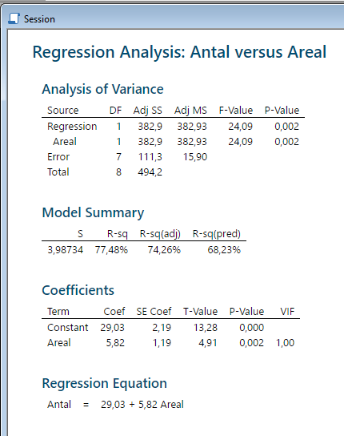
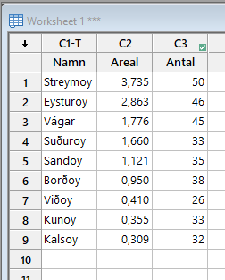
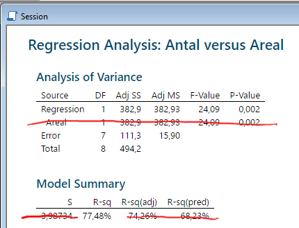
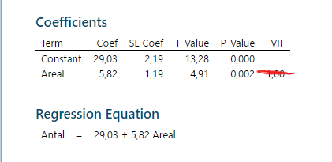
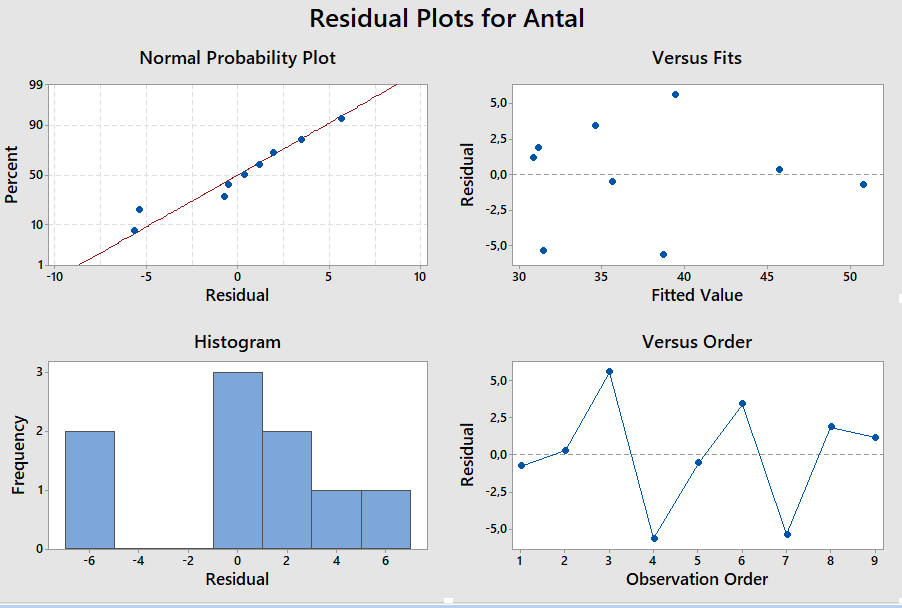
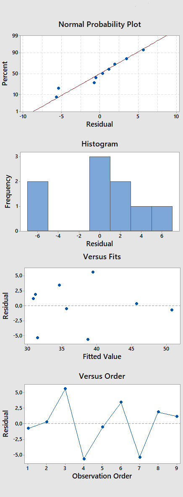

```{r setup, include=FALSE}
knitr::opts_chunk$set(echo = TRUE, warning = F, message = F, error = F)
```

```{r, echo = F}
library(ggplot2)
library(dplyr)
library(cowplot)
library(extrafont)
library(patchwork)
library(tidyr)
library(gridExtra)

theme_set(theme_bw() + theme(plot.background = element_rect(fill = "#ffffe6", color = "#ffffe6"),
                             legend.box.background = element_rect(color = "black")))
```

#

<div style="position:absolute;width:80%;height:400px;border: 10px double;padding: 150px 10px; left:10%; top:100px;">
<p style="text-align:center;font-size: 2em;">
Regressionsanalys och korrelation
</p>

<p style="text-align:center;">
Motsvarar *Biometri*, kap 11
</p>
</div>

# I korthet

Vi samlar in två numeriska variabler från en samling objekt

<div class="fragment fade-in">
Vill undersöka hur de förhåller sig till varandra
</div>

<div class="fragment fade-in">
Med **regression** kan vi skapa en modell för variabel som en funktion av den andra
</div>

<div class="fragment fade-in">
Med **korrelation** kan vi mäta styrkan på sambandet mellan variablerna
</div>

<div class="fragment fade-in">
Sambandet mellan variablerna kan testas med **t-test** eller **F-test**
</div>

# Korrelation och regression

Korrelation och regression är metoder för att mäta ett samband mellan två eller flera variabler

<div class="fragment fade-in">
**Regression**

En variabel (en *svarsvariabel*) förklaras av en andra variabel (en *förklarande variabel*)

*För ett givet värde av den förklarande variabeln, vilket är det förväntade värdet av svarsvariabeln?*
</div>

<div class="fragment fade-in">
**Korrelation**

Graden av linjärt förhållande mellan två numeriska variabler

De två variablerna är av *lika* betydelse (du kan byta deras ordning och korrelationen är densamma)
</div>

# Enkel linjär regression

<div class="fragment fade-in" data-fragment-index="3" style="float:right;">
```{r, echo = F, warning=F, fig.align='center', fig.width=5, fig.height=8}
dat1 <- structure(list(Name = c("Streymoy", "Eysturoy", "Vágar", "Suðuroy", "Sandoy", "Borðoy", "Viðoy", "Kunoy", "Kalsoy", "Jersey", "Guernsey", 
                                "Alderney", "Sark", "Herm"), 
                       `Area (100 square km)` = c(3.735, 2.863, 1.776, 1.66, 1.121, 0.95, 0.41, 0.355, 0.309, 1.18, 0.65, 0.08, 0.05, 0.02), 
                       Group = c("Faroe", "Faroe", "Faroe", "Faroe", "Faroe", "Faroe", "Faroe", "Faroe", "Faroe", "Channel", "Channel", "Channel", "Channel", "Channel"), 
                       `Number of species` = c(50, 46, 45, 33, 35, 38, 26, 33, 32, 98, 74, 55, 69, 59), 
                       Latitud = c(62.15, 62.21, 62.09, 61.53, 61.85, 62.27, 62.32, 62.3, 62.3, 49.22, 49.45, 49.71, 49.43, 49.47)), 
                  row.names = c(NA, -14L), class = c("tbl_df", "tbl", 
                                                     "data.frame"))

library(ggplot2)
library(gridExtra)
g1 <- ggplot(dat1[dat1$Group == "Faroe",], aes(`Area (100 square km)`, `Number of species`, label = Name)) + 
  geom_point(fill = "grey", col = "black", shape = 21, size = 3) +
  geom_text(hjust = -0.2) +
  xlim(0, 5) +
  ylim(0, 50)

g2 <- ggplot(dat1[dat1$Group == "Faroe",], aes(`Area (100 square km)`, `Number of species`, label = Name)) + 
  geom_smooth(method = "lm", se = F, col = "red", alpha = 0.3) +
  geom_point(fill = "grey", col = "black", shape = 21, size = 3) +
  geom_text(hjust = -0.2) +
  xlim(0, 5) +
  ylim(0, 50)

g1 / g2

datFaroe <- dat1[dat1$Group=="Faroe",]
```
</div>

Två kontinuerliga variabler, $x$ och $y$

<div class="fragment fade-in" data-fragment-index="1">
Parade så att $x_i$ och $y_i$ kommer från samma objekt
</div>

<div class="fragment fade-in" data-fragment-index="2">
Modell för $y$ som en funktion av $x$
</div>

<div class="fragment fade-in" data-fragment-index="3">
```{r, echo = F}
dat2 <- dat1 %>% 
  filter(Group == "Faroe") %>% 
  select(-Group, -Latitud)
knitr::kable(dat2)
```
</div>

## Modellformulering

För en observation av $y$ kan vi formulera följande modell

$$y_i = \beta_0 + \beta_1 x_i + e_i \qquad e_i \sim N(0,\sigma^2)$$

<div style="float:right; width:50%">
```{r, echo = F}
g2
```
</div>

<br>

<div class="fragment fade-in">
$\beta_0$ - intercept, det uppskattade värdet av $y$ när $x$ är noll
</div>

<div class="fragment fade-in">
$\beta_1$ - lutning, den beräknade marginella förändringen i $y$ när $x$ ökar med ett
</div>

<div class="fragment fade-in">
Residualer: $\hat e_i = y_i - \beta_0 - \beta_1 x_i$
</div>

<div class="fragment fade-in">
Variabeln $y$ kallas *svarsvariabel*, *responsvariabel*, *beroende variabel* eller *förklarad variabel*

Variabeln $x$ kallas *oberoende variabel* eller *förklarande variabel*
</div>

## Skattning av intercept och lutning

Om $\hat \beta_0$ och $\hat \beta_1$ är skattningar av intercept och lutning, ges residualen av

$$\hat e_i = y_i - \hat \beta_0 - \hat \beta_1 x_i$$

<div class="fragment fade-in">
De skattade parametrarna $\hat \beta_0$ och $\hat \beta_1$ väljs så att summan av kvadrerade residualer minimeras
</div>

```{r, echo = F, fig.align='center', fig.height=4, fig.width=10}
dat1 %>% 
  filter(Group == "Faroe") -> dat2
g_sst <- dat2 %>% 
  ggplot(aes(`Area (100 square km)`, `Number of species`)) +
  geom_point() +
  geom_hline(yintercept = mean(dat2$`Number of species`)) +
  geom_segment(aes(xend = `Area (100 square km)`, yend = mean(`Number of species`))) +
  ggtitle("Skillnader mellan observation och medelvärde")

dat2 <- dat2 %>% 
  mutate(pred = predict(lm(`Number of species` ~ `Area (100 square km)`)))

g_sse <- dat2 %>% 
  ggplot(aes(`Area (100 square km)`, `Number of species`)) +
  geom_point() +
  geom_smooth(method = lm, se = F) +
  geom_segment(aes(xend = `Area (100 square km)`, yend = pred)) +
  ggtitle("Skillnader mellan observation och regressionslinje")

g_sst + g_sse
```

## Minitab-utskrifter

<div style="float:right;width:45%;">


<br>


</div>

<div class="fragment fade-in">
Data skrivs in i ett *Worksheet* med en rad för varje observation
</div>

<div class="fragment fade-in">
Regressionen skattas genom *Stat > Regression > Regression > Fit Regression Model...*
</div>

<div class="fragment fade-in">
Utskriften ger

>- *Analysis of Variance.* En anova-tabell lik den vi sett tidigare
>- *Model summary.* Mått på modellanpassning
>- *Coefficient.* Skattade parametrar
>- *Regression equation.* Den skattade regressionsekvationen

</div>

## Anova-tabell och modellanpassning

<div style="float:right">

</div>

Tolkningen av anova-tabellen liknar den vid variansanalys

>- *DF.* Antal frihetsgrader. Regressionen har en frihetsgrad, residualen har $N-2$ frihetsgrader, och totalen $N-1$ frihetsgrad
>- *Adj SS.* Kvadratsummor beräknade från datan
>- *Adj MS.* Kvadratsumman delat på antalet frihetsgrader
>- *F-Value.* Testvärde i ett F-test. Ges av $\frac{MS_R}{MS_e} = \frac{382.93}{15.90} = 24.09$
>- *P-Value.* P-värde för F-testet beräknat som svansen i en F-fördelning med $\nu_1 = 1$ och $\nu_2 = N-2$

<br>

<div class="fragment fade-in">
**Determinationskoefficienten**

Det mest relevanta måttet i *Model Summary* är *determinationskoefficienten* $R^2$ (*R-sq*)
</div>

<div class="fragment fade-in">
$R^2$ ges av kvoten $SS_R/SS_T$ och mäter hur mycket av den totala variationen som förklaras av regressionsmodellen
</div>

## Skattade parameterar och modellekvation

<div style="float:right">
<br><br>

</div>

<div class="fragment fade-in">
*Coefficient* ger skattningarna av modellens parameterar
</div>

<div class="fragment fade-in">
Interceptet står som *Constant* och lutningen som den oberoende variabeln (här *Areal*)

>- *Coef.* Själva skattningen
>- *SE Coef.* Skattningens medelfel
>- *T-Value.* Skattningen delat på medelfelet. Testvärde vid ett t-test
>- *P-value.* P-värdet beräknat från en t-fördelning med $N-2$ frihetsgrader
>- *VIF.* Ej relevant vid enkel linjär regression

</div>

<div class="fragment fade-in">
*Regression Equation* ger den skattade modellekvationen
</div>

<div class="fragment fade-in">
En beräkning för ett visst x-värde ger en prediktion av y-variabeln vid det x-värdet
</div>

<div class="fragment fade-in">
Det predikerade antalet arter på en 200 kvadratkilometer stor ö väntas vara

$$29.03 + 5.82 \cdot 2 = 40.67$$
</div>

## Tester

Vi kan göra hypotestester på $\beta_0$ och $\beta_1$

<div class="fragment fade-in">
Det vanligaste testet är av $H_0: \beta_1 = 0$, dvs om det finns en lutning skild från noll
</div>

<div class="fragment fade-in">
Detta kan testas med ett F-test eller ett t-test
</div>

<div class="fragment fade-in">
```{r, echo = F, fig.height=4, fig.align='center', fig.width=8}
dat_f <- tibble(x = seq(0.01, 30, 0.01), y = df(x, 1, 7))
g_f <- ggplot(dat_f, aes(x, y)) + 
  geom_line() +
  geom_ribbon(aes(x, ymax = y, ymin = 0), data = dat_f %>% filter(x >= 24.09), fill = "red") +
  xlab("") +ylab("") +
  scale_x_continuous(breaks = 24.09) +
  ggtitle("F-fördelning med 1 och 7 frihetsgrader")

dat_t <- tibble(x = seq(-6,6,0.01), y = dt(x, 7))
g_t <- ggplot(dat_t, aes(x, y)) + 
  geom_line() +
  geom_ribbon(aes(x, ymax = y, ymin = 0), data = dat_t %>% filter(x >= 4.91), fill = "red") +
    geom_ribbon(aes(x, ymax = y, ymin = 0), data = dat_t %>% filter(x <= -4.91), fill = "red") +
  xlab("") +ylab("") +
  scale_x_continuous(breaks = c(-4.91, 0, 4.91), labels = c("-4.91", "0", "4.91")) +
  ggtitle("t-fördelning med 7 frihetsgrader")

g_f + g_t
```
</div>

<div class="fragment fade-in">
Antalet frihetsgrader för t-fördelning och för nämnaren i F-fördelningen ges av $N-2$
</div>

## Modellantaganden

<div class="fragment fade-in">
Statistiska tester av regressionsmodellen bygger på följande antaganden

>- Normalfördelade residualer
>- Lika varians i $y$ för alla nivåer av $x$
>- Oberoende observationer
</div>

<div class="fragment fade-in">
Antaganden kan testas genom formella tester eller genom residualplottar
</div>

## Residualplottar

Minitab ger fyra grundläggande residualplottar

(Klicka i *Four in one* under *Graphs* i regressionsfönstret)



##

<div style="float:right">

</div>

<br>

**Normalfördelningsantagandet**

>- I normalfördelningsplotten (övre vänster) ska punkterna ligga nära den diagonala linjen
>- I histogrammet ska observationerna följa en normalfördelning

<div class="fragment fade-in">
**Lika varians**

>- I spridningsdiagrammet (övre höger) ska spridningen kring den streckade linjen vara densamma för olika x-värden
</div>

<div class="fragment fade-in">
**Oberoende**

>- I linjediagrammet (nedre höger) ska det saknas mönster - residualerna ska vara oberoende av observationernas ordning
>- Bara relevant om observationerna är ordnade i någon naturlig ordning, t.ex. om man samlat in data över tid
</div>

## Hantering av brister i antaganden

Vanligt att åtgärda brister i modellantaganden

<div class="fragment fade-in">
**Datatransformationer** 

>- Istället för $y$, skattas modellen på $\sqrt y$ eller $\log(y)$
>- Parametertolkning måste ske i ljuset av transformationen
</div>

<div class="fragment fade-in">
**Granskning av extremvärden**

>- Om det finns tydliga extremvärden kan man undersöka om det är resultatet av någon felmätning
>- I vissa fall kan extremvärden uteslutas ur analysen
</div>

<div class="fragment fade-in">
**Icke-parametriska metoder**

>- Statistiska metoder som saknar fördelningsantagande
>- Se *Biometri*, kap 12. (Ej del av kursen.)
</div>

<div class="fragment fade-in">
**Multipel regression**

>- Enkel regression kan utvecklas med *multipel regression*
>- Medtar ytterligare variabler i modellen
</div>

# Korrelation

<div class="fragment fade-in">
Sambandet mellan två numeriska variablerna kan också undersökas med korrelation
</div>

<div class="fragment fade-in">
Korrelation är ett mått på graden på **linjär** relation mellan två variabler
</div>

<div class="fragment fade-in">
Variablerna ses som likvärdiga - man ser inte den ena som en funktion av den andra
</div>

<div class="fragment fade-in">
Anges som ett tal mellan -1 och 1, där negativa värden pekar på ett negativt samband och positiva på ett positivt samband
</div>

<div class="fragment fade-in">
```{r, echo = F, fig.align='center', fig.width=16, fig.height=4}
set.seed(18)
dat <- data.frame(x = rnorm(50), y = rnorm(50))
dat$y <- residuals(lm(y ~ x, dat))

dat <- scale(dat) %>% as.data.frame()

dat %>% 
  mutate(y_m1 = -x,
         y_m05 = -x + sqrt(3) * y,
         y_0 = y,
         y_p05 = x + sqrt(3) * y,
         y_p1 = x) -> dat

dat %>% 
  select(-y) %>% 
  pivot_longer(-x) %>% 
  mutate(Correlation = recode(name,
                              "y_m1" = "-1",
                              "y_m05" = "-0.5",
                              "y_0" = "0",
                              "y_p05" = "0.5",
                              "y_p1" = "1"),
         Correlation = factor(Correlation, levels = seq(-1, 1, 0.5))) %>% 
  ggplot(aes(x, value)) + 
  geom_point() +
  geom_smooth(method = "lm", se = F) +
  facet_wrap(~ Correlation, ncol = 5) +
  ylab("y")
```
</div>

## Beräkning

Det finns olika typer av korrelation, den vanligaste är *Pearsonkorrelation*, betecknad med r

<div class="fragment fade-in">
*Pearsonkorrelation* beräknas genom

$$r = \frac{ \sum_{i = 1}^n (x_i - \bar x)(y_i - \bar y) / (n - 1) }{ s_x \cdot s_y }$$
</div>

<div class="fragment fade-in">
Täljaren $\sum_{i = 1}^n (x_i - \bar x)(y_i - \bar y) / (n - 1)$ är *kovariansen*
</div>

## Linjär relation och oberoende

Korrelation mäter det *linjära* sambandet

<div class="fragment fade-in">
Det kan finnas ett starkt samband mellan två variabler även om korrelationen är låg
</div>

<div class="fragment fade-in">
Korrelationen kan vara hög på grund av extremvärden

Storskaliga skillnader mellan grupper kommer att påverka korrelationen mer än småskaliga skillnader inom grupper (*Simpsons paradox*)
</div>

<div class="fragment fade-in">
```{r, echo = F, fig.align='center', fig.width=12, fig.height=4}
set.seed(8)
dat <- tibble(x = seq(-2,2,0.1), "Kvadratisk" = x^2,
              "Cyklisk" = cos(3 * x))
dat2 <- tibble(x = c(rnorm(50), 10), name = "Extremvärden", y = c(rnorm(50), 10))
dat3 <- tibble(x = c(rnorm(25, mean = 10), rnorm(25, mean = 0)),
               name = "Gruppskillnader",
               y = c(rnorm(25, mean = 0), rnorm(25, mean = 10)))

# cor(dat2$x, dat2$y)

dat %>% 
  pivot_longer(-x, values_to = "y") %>% 
  bind_rows(dat2, dat3) %>% 
  mutate(name = factor(name, levels = c("Kvadratisk", "Cyklisk", "Extremvärden", "Gruppskillnader"))) %>% 
  ggplot(aes(x, y)) +
  geom_point() +
  geom_smooth(method = lm, se = F) +
  facet_wrap(~ name, ncol = 4, scales = "free")
```

Korrelationerna är 0, 0, 0.66 respektive -0.95
</div>

## Determinationskoefficienten och tester

Korrelation $r$ i kvadrat ger determinationskoefficienten $R^2$ från regressionen

<div class="fragment fade-in">
Korrelation kan testas med nollhypotesen $H_0: r = 0$ (okorrelerade variabler) genom ett t-test
</div>

<div class="fragment fade-in">
Testet ger samma utfall som ett test för $H_0: \beta_1 = 0$ i en regression
</div>

#

<div style="position:absolute;width:80%;height:400px;border: 10px double;padding: 150px 10px; left:10%; top:100px;">
<p style="text-align:center;font-size: 2em;">
Slut
</p>

</div>